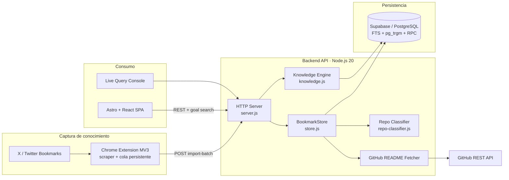
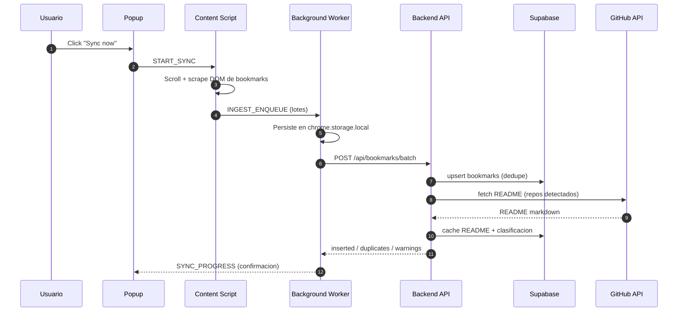
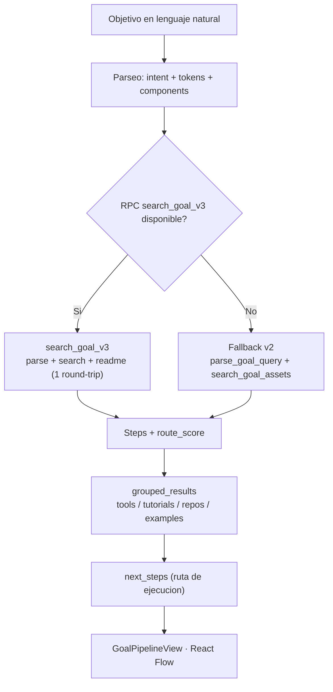
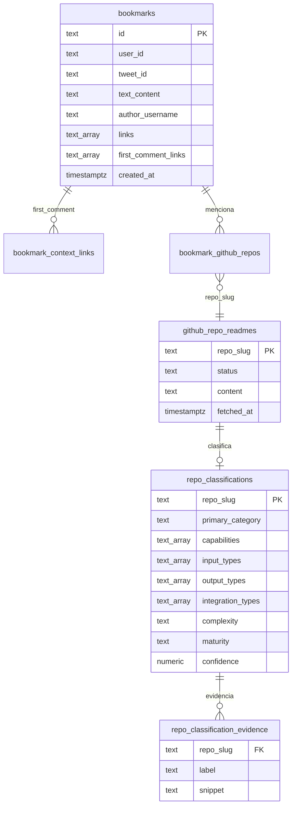
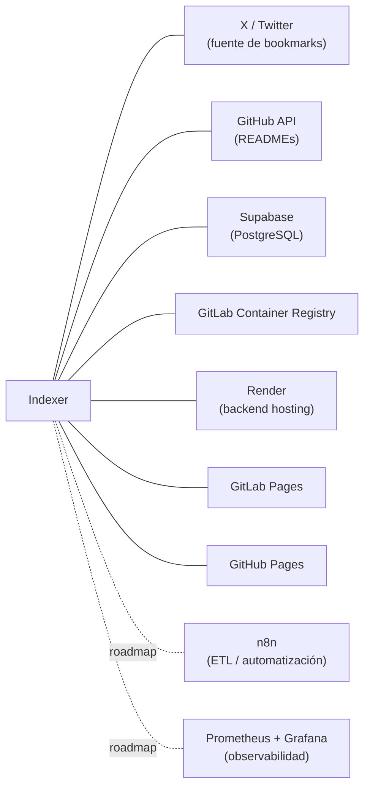
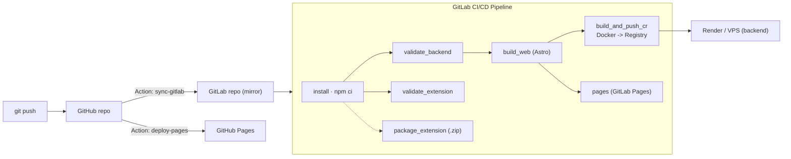
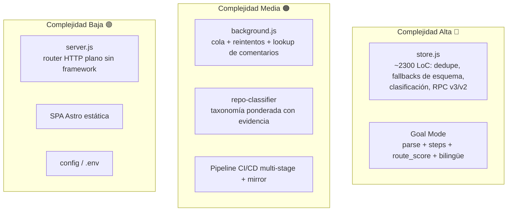

# Indexer — Technical Knowledge Operating System

> **Visión (Manifiesto):** transformar conocimiento técnico fragmentado en sistemas ejecutables.
> El flujo deja de ser `Objetivo → Buscar → Leer → Guardar → Olvidar` y pasa a ser
> **`Objetivo → Ruta → Arquitectura → Ejecución`**.

Indexer (alias **Indexbook**) es un sistema que **captura, indexa, clasifica y enruta** conocimiento
técnico. En su MVP actual extrae *bookmarks* de X (Twitter) mediante una extensión de Chrome, los
ingiere por lotes en un backend propio, enriquece los repositorios de GitHub mencionados (README +
clasificación de capacidades) y los expone a través de una búsqueda híbrida, semántica y **orientada
a objetivos** (*goal mode*) que devuelve rutas de implementación, no solo resultados.

---

## Tabla de contenidos

- [Quick facts](#quick-facts)
- [¿Qué es Indexer?](#qué-es-indexer)
- [Capacidades](#capacidades)
- [Inputs](#inputs)
- [Outputs](#outputs)
- [Arquitectura](#arquitectura)
- [Modelo de datos](#modelo-de-datos)
- [Dependencias](#dependencias)
- [Integraciones](#integraciones)
- [Casos de uso](#casos-de-uso)
- [API Reference](#api-reference)
- [CI/CD y DevOps](#cicd-y-devops)
- [Despliegue](#despliegue)
- [Estructura del repositorio](#estructura-del-repositorio)
- [Desarrollo local](#desarrollo-local)
- [Variables de entorno](#variables-de-entorno)
- [Nivel de complejidad](#nivel-de-complejidad)
- [Roadmap](#roadmap)

---

## Quick facts

| Aspecto | Detalle |
|---|---|
| **Tipo** | Monorepo NPM Workspaces (extensión + backend + frontend + tooling) |
| **Backend** | Node.js 20, ES Modules, `node:http` nativo (sin framework) |
| **Frontend** | Astro 5 + React 19 + `@xyflow/react` (React Flow) — SPA estática |
| **Extensión** | Chrome Manifest V3 (JS vanilla) |
| **Persistencia** | Supabase (PostgreSQL): FTS `tsvector`, `pg_trgm`, funciones RPC |
| **Migraciones** | 13 archivos SQL versionados (`001` → `013`) |
| **Empaquetado** | Docker multi-stage → GitLab Container Registry |
| **CI/CD** | GitLab CI/CD (`install → validate → build → deploy`) + GitHub Actions |
| **Hosting** | Backend en Render · Frontend en GitHub Pages / GitLab Pages |
| **Complejidad** | 🟠 Media-Alta (sistema distribuido multi-componente) |

---

## ¿Qué es Indexer?

Según el [`indexer_manifesto.md`](./indexer_manifesto.md), Indexer es simultáneamente:

- **Knowledge engine** — convierte fuentes (repos, READMEs, bookmarks, artículos) en capacidades estructuradas.
- **Route engine** — ante un objetivo, identifica etapas, capacidades, herramientas, alternativas y dependencias.
- **Architecture planner** — ensambla una ruta de implementación priorizada.
- **Workflow discovery system** — descubre los caminos para pasar de la idea al sistema ejecutable.

**Principios rectores:** capacidades antes que repositorios · rutas antes que resultados · contexto antes
que keywords · relaciones antes que registros · ejecución antes que exploración.

---

## Capacidades

### 1. Captura de conocimiento (extensión Chrome MV3)
- Scraping de *bookmarks* de `x.com` / `twitter.com` con scroll infinito y *batch builder*.
- Resolución de URLs acortadas (`t.co`, `bit.ly`, `lnkd.in`, …) siguiendo redirecciones.
- Detección y extracción de **"links del primer comentario"** abriendo el detalle del tweet en una pestaña silenciosa.
- **Cola persistente** en `chrome.storage.local` con reintentos exponenciales (`MAX_RETRIES = 3`) y *badge* de estado.
- Deduplicación local contra los IDs ya almacenados en backend (`/bookmarks/ids` con *fallback* a búsqueda).

### 2. Ingesta y normalización (backend)
- Endpoints de ingesta por lotes con validación de `tweet_id`, deduplicación y *insert-only*.
- Normalización de bookmarks, expansión de *shorteners* del lado servidor y sincronización de *context links*.
- Tolerancia a esquema: el backend **degrada con gracia** (warnings) si una migración SQL aún no se aplicó.

### 3. Enriquecimiento de repos GitHub
- Detección de `owner/repo` en texto, links y comentarios.
- *Fetch* del README vía GitHub API con **caché TTL** (168 h por defecto) y límites de tamaño.
- **Clasificador de repos** (`repo_classifier_v1`) que infiere, con pesos y evidencia trazable:
  - `primary_category`, `secondary_categories`
  - `capabilities`, `input_types`, `output_types`, `integration_types`
  - `target_domains`, `tech_stack`, `deployment_modes`, `constraints`
  - `complexity` (`basic | intermediate | advanced`) y `maturity` (`prototype | usable | production`).

### 4. Búsqueda y enrutamiento
- **Búsqueda híbrida** (FTS + `pg_trgm`) con ranking (`text_rank`, `author_boost`, `freshness_boost`),
  parsing de filtros, exclusiones y *fallback* por término.
- **Búsqueda semántica** sobre corpus en memoria (`/search/semantic`).
- **Goal Mode** (`POST /search/goal`): parsea el objetivo → detecta intención y componentes →
  `search_goal_v3` (una sola ida a DB) con *fallback* v2 → devuelve **steps**, **route_score**
  (cobertura 70% + calidad 30%) y **next_steps** ejecutables.
- **Knowledge graph** y relaciones: `/discover`, `/clusters`, `/trending`, `/related/:id`, `/graph/:id`.

### 5. Consumo / visualización
- SPA en Astro+React con vistas: búsqueda, **GoalPipelineView** (React Flow), Autores, Repos, READMEs.
- Consola HTML independiente (`tools/live-query-console`) conectada a la API real.

---

## Inputs

| Input | Origen | Vía de entrada |
|---|---|---|
| Bookmarks de X/Twitter | DOM de `x.com/i/bookmarks` | Extensión → `POST /bookmarks/import-batch` / `/api/bookmarks/batch` |
| Links de primer comentario | Detalle del tweet | Content script (`EXTRACT_FIRST_COMMENT_LINKS`) |
| READMEs de GitHub | GitHub REST API | Backend (`fetch-github-readmes`) con `GITHUB_TOKEN` |
| Objetivo en lenguaje natural | Usuario en la SPA | `POST /search/goal` `{ goal }` |
| Query + filtros | Usuario | `GET /search?q=&author=&domain=&from=&to=` |
| Configuración | `.env` / `chrome.storage` | `SUPABASE_*`, `apiBaseUrl`, `userId` |

---

## Outputs

| Output | Endpoint / artefacto | Forma |
|---|---|---|
| Resultados híbridos rankeados | `GET /search`, `/api/bookmarks/search` | `items[]` + `score_breakdown` + `parsed_query` |
| Resultados semánticos | `GET /search/semantic` | `items[]` con relevancia |
| **Ruta de objetivo** | `POST /search/goal` | `steps[]`, `route_score`, `next_steps[]`, `grouped_results` |
| Clasificación de repos | embebida en resultados / READMEs | `RepoClassification` (capabilities, inputs, outputs…) |
| README cacheado | `GET /api/github-readmes(/owner/repo)` | contenido + metadata + clasificación |
| Grafo / clusters / trending | `/graph/:id`, `/clusters`, `/trending`, `/discover` | nodos, aristas y agregados |
| Artefactos CI | Pipeline GitLab | `web-astro/dist`, `x-bookmarks-extension.zip`, imagen Docker |

---

## Arquitectura

### Vista de componentes



### Flujo de ingesta (extremo a extremo)



### Flujo de búsqueda por objetivo (Goal Mode)



---

## Modelo de datos

13 migraciones SQL versionadas en [`backend/sql/`](./backend/sql) (`001` → `013`). Núcleo relacional:



| # | Migración | Aporte |
|---|---|---|
| 001 | `bookmarks_schema` | Tabla `bookmarks`, `bookmark_context_links`, índices + FTS español |
| 002 | `search_bookmarks` | Función RPC de búsqueda inicial |
| 003 | `goal_search_schema` | Esquema y RPC de *goal search* (v1/v2) |
| 004 | `search_bookmarks_scalable` | Búsqueda híbrida escalable (FTS + trgm) |
| 005 | `bookmark_context_links` | Persistencia de links de primer comentario |
| 006 | `goal_search_refresh_dedup` | Refresh + deduplicación del índice de objetivos |
| 007 | `github_repo_readmes` | Tablas de READMEs y relación bookmark↔repo |
| 008 | `goal_search_v3` | RPC unificada `search_goal_v3` (1 round-trip) |
| 009 | `goal_search_bilingual` | Soporte bilingüe (ES/EN) |
| 010 | `repo_classifier` | `repo_classifications` + `repo_classification_evidence` |
| 011 | `search_camelcase_tsquery_fix` | Fix de `tsquery` para camelCase |
| 012 | `search_bookmarks_use_normalized_tsquery` | Normalización de `tsquery` |
| 013 | `goal_step_metadata` | Metadata de *steps* (`get_step_metadata`) |

---

## Dependencias

### Backend (`backend/`)
- **Runtime:** Node.js 20 (ES Modules), servidor `node:http` nativo (sin Express).
- `@supabase/supabase-js` ^2.103 — cliente de datos y RPC.
- `dotenv` ^17 — variables de entorno.

### Frontend (`web-astro/`)
- `astro` ^5.9 (`output: static`) + `@astrojs/react` ^5.
- `react` / `react-dom` ^19.
- `@xyflow/react` ^12 — visualización de grafos / pipeline.

### Extensión (`extension/`)
- JS vanilla, sin dependencias de build. Chrome **Manifest V3**.
- Permisos: `storage`, `tabs`, `activeTab`, `scripting`; `host_permissions: *://*/*`.

### Tooling
- `scripts/demo-video/` — generador de video demo (record / narrate / compose).
- `tools/live-query-console/` — consola HTML autónoma contra la API.

---

## Integraciones



| Integración | Rol | Estado |
|---|---|---|
| **X / Twitter** | Fuente primaria de conocimiento (bookmarks) | ✅ Activo |
| **GitHub REST API** | README + señales de clasificación | ✅ Activo (token opcional) |
| **Supabase / PostgreSQL** | Persistencia, FTS y RPC | ✅ Activo |
| **GitLab CI/CD + Registry** | Pipeline e imágenes Docker | ✅ Activo |
| **Render** | Hosting del backend (`indexer-hzto.onrender.com`) | ✅ Activo |
| **GitHub / GitLab Pages** | Hosting del frontend estático | ✅ Activo |
| **n8n** | Flujos ETL de ingesta | 🟡 Planeado (docs) |
| **Prometheus + Grafana** | Métricas y dashboards | 🟡 Planeado (docs) |

---

## Casos de uso

1. **"Ir de la idea al sistema ejecutable" (Goal Mode).** El usuario escribe *"construir un scraper que
   guarde embeddings y exponga una API"* y recibe una ruta con etapas (`data_extraction → storage →
   api_layer`), repos/tutoriales por etapa, `route_score` y *next steps*.
2. **Memoria técnica personal.** Convierte cientos de bookmarks olvidados de X en un corpus buscable con
   filtros por autor, dominio y fecha.
3. **Descubrimiento de capacidades.** En lugar de "qué repos guardé", responde "qué capacidades tengo
   disponibles" (scraping, vector store, agent runtime, outreach…).
4. **Curación de repos de GitHub.** Clasifica automáticamente repos mencionados por capacidades, stack,
   modo de despliegue y madurez.
5. **Exploración relacional.** Clusters por autor/dominio/repo, *trending*, contenidos relacionados y
   grafo de conocimiento.
6. **Base para automatización ETL.** El backend desacoplado sirve como núcleo para flujos n8n e ingesta
   de otras fuentes (artículos, videos).

---

## API Reference

Base URL por defecto: `https://indexer-hzto.onrender.com`

| Método | Ruta | Descripción |
|---|---|---|
| `GET` | `/health` | Estado del servicio + total de bookmarks |
| `GET` | `/users` | Usuarios y conteos |
| `POST` | `/bookmarks/import-batch` | Ingesta del DOM scanner (insert-only, dedupe) |
| `POST` | `/api/bookmarks/batch` | Ingesta por lotes (legacy / upsert) |
| `GET` | `/bookmarks/ids` | IDs almacenados (para dedupe en la extensión) |
| `GET` | `/search`, `/api/bookmarks/search` | Búsqueda híbrida (FTS + trgm) |
| `GET` | `/search/semantic` | Búsqueda semántica sobre corpus |
| `POST` | `/search/goal` | **Goal Mode**: steps + route_score + next_steps |
| `GET` | `/discover` | Descubrimiento de contenidos |
| `GET` | `/clusters?type=author\|domain\|repo` | Agrupaciones |
| `GET` | `/trending` | Tendencias |
| `GET` | `/related/:id` | Relacionados a un bookmark |
| `GET` | `/graph/:id` | Subgrafo de conocimiento |
| `GET` | `/api/github-readmes(/owner/repo)` | READMEs cacheados + clasificación |

> CORS configurable vía `ALLOWED_ORIGINS`. Errores devuelven `{ ok:false, trace_id, error }`.

---

## CI/CD y DevOps

El repositorio se desarrolla en GitHub y se **espeja a GitLab** (`gitlab.com/juanku2003/indexer`)
mediante GitHub Actions, donde corre el pipeline CI/CD. El orquestador
[`.gitlab-ci.yml`](./.gitlab-ci.yml) incluye [`.ci-jobs.yml`](./.ci-jobs.yml) (CI) y
[`.cd-jobs.yml`](./.cd-jobs.yml) (CD).



**Stages:** `install → validate → build → build_and_push_cr → deploy`.

- **`install`** — `npm ci`, cachea `node_modules/` (artifact 1 h).
- **`validate_backend`** — `node --check` de cada `backend/src/*.js`, lint/typecheck/test *si existen*, y
  verificación de orden/no-vacío de las migraciones SQL.
- **`validate_extension`** — `node --check` de la extensión + validación del `manifest.json` (MV3, archivos referenciados existen).
- **`build_web`** — build de Astro → artifact `web-astro/dist/` (1 semana).
- **`build_and_push_cr`** — Docker-in-Docker: build y push de `:latest` y `:$CI_COMMIT_SHORT_SHA` al Container Registry.
- **`package_extension`** — empaqueta `dist/x-bookmarks-extension.zip` (imagen PowerShell).
- **`pages`** — publica el frontend en GitLab Pages (solo rama por defecto).

**GitHub Actions complementarias:** `sync-gitlab.yml` (mirror + trigger) y `deploy-pages.yml` (GitHub Pages, `base=/indexer`).

> 📐 **Sobre los diagramas Mermaid:** todos los bloques usan fences ```` ```mermaid ````, etiquetas
> entre comillas cuando contienen caracteres especiales (`/`, `()`), sin eventos `click` ni HTML crudo
> (compatibles con el `securityLevel: strict` del renderizador de GitLab) y se mantienen por debajo del
> límite de tamaño de GitLab.

---

## Despliegue

| Componente | Destino | Notas |
|---|---|---|
| Backend | **Render** (`indexer-hzto.onrender.com`) o VPS vía Docker | `EXPOSE 8080`, `node src/server.js` |
| Imagen Docker | **GitLab Container Registry** | Multi-stage; sirve `web-astro/dist` desde `backend/public` |
| Frontend | **GitHub Pages** (`/indexer`) y **GitLab Pages** | Build estático de Astro |
| DB | **Supabase** | Aplicar `backend/sql/*.sql` en orden |
| Extensión | **Chrome Web Store** (`.zip`) | Ajustar `DEFAULT_API_BASE_URL` y `host_permissions` |

Guías detalladas: [`docs/production-deploy.md`](./docs/production-deploy.md),
[`docs/devops-architecture/`](./docs/devops-architecture/).

---

## Estructura del repositorio

```text
indexer/
├── backend/                # API HTTP Node.js + clasificador + fetch READMEs
│   ├── src/                # server, store, knowledge, repo-classifier, ...
│   └── sql/                # 13 migraciones (001 → 013)
├── web-astro/              # SPA Astro + React (search, goal, repos, authors)
│   └── src/{components,lib,pages}
├── extension/              # Chrome MV3 (background, content, popup, page-bridge)
├── docs/                   # PRD, SRS, arquitectura DevOps, diagramas
│   └── requirements-and-design/
├── tools/live-query-console/   # Consola HTML autónoma contra la API
├── scripts/                # package-extension.ps1 + generador de demo-video
├── Dockerfile              # Imagen multi-stage de producción
├── .gitlab-ci.yml          # Orquestador del pipeline
├── .ci-jobs.yml / .cd-jobs.yml
└── indexer_manifesto.md    # Visión y principios
```

---

## Desarrollo local

El repo es un **NPM Workspace**. Desde la raíz:

```bash
# 1. Instalar todas las dependencias (backend + web + demo)
npm install

# 2. Backend en modo desarrollo (node --watch)
npm run dev:backend

# 3. Frontend en modo desarrollo (Astro)
npm run dev:web

# Build de producción del frontend
npm run build:web

# Backend en producción
npm run start:backend
```

**Cargar la extensión en Chrome:**
1. Ir a `chrome://extensions` → activar **Modo de desarrollador**.
2. **Cargar descomprimida** → seleccionar la carpeta `extension/`.
3. Abrir `https://x.com/i/bookmarks`, abrir el popup y pulsar **Sync now**.

**Scripts de backend útiles:** `npm run migrate:data`, `readmes:github`, `readmes:backfill`, `classify:repos`.

---

## Variables de entorno

`backend/.env` (ver [`backend/.env.example`](./backend/.env.example)):

| Variable | Default | Propósito |
|---|---|---|
| `PORT` | `8787` | Puerto del backend |
| `MAX_BATCH_SIZE` | `50` | Tope de items por lote |
| `ALLOWED_ORIGINS` | `*` | Orígenes CORS permitidos |
| `SUPABASE_URL` | — | **Requerido** |
| `SUPABASE_SERVICE_ROLE_KEY` | — | Preferido (mantiene RLS) |
| `SUPABASE_ANON_KEY` | — | Alternativa al service role |
| `GITHUB_TOKEN` | — | Evita límites de la API de GitHub |
| `GITHUB_README_MAX_PER_BATCH` | `8` | READMEs por lote |
| `GITHUB_README_MAX_CHARS` | `300000` | Tamaño máximo de README |
| `GITHUB_README_TTL_HOURS` | `168` | TTL de la caché de README |

Frontend: `PUBLIC_SEARCH_API_BASE` (override de la API), `PUBLIC_SITE_URL`, `PUBLIC_BASE_PATH`.
Extensión: `apiBaseUrl` y `userId` en `chrome.storage.local`.

---

## Nivel de complejidad

**Valoración global: 🟠 Media-Alta.** No por complejidad algorítmica aislada, sino por ser un **sistema
distribuido de 4 planos** (navegador → API → DB → frontend) con tres lenguajes de ejecución, esquema
evolutivo y un pipeline CI/CD multi-destino.



| Componente | Complejidad | Driver principal |
|---|---|---|
| `backend/src/store.js` | 🔴 Alta | Deduplicación, *graceful degradation* por migración faltante, clasificación, RPC v3→v2 |
| Goal Mode (search) | 🔴 Alta | Parsing de intención, *steps*, `route_score`, bilingüe, dos rutas RPC |
| `extension/background.js` | 🟠 Media | Cola persistente, reintentos, *first-comment lookup* en pestaña silenciosa |
| `repo-classifier.js` | 🟠 Media | Taxonomía ponderada con evidencia trazable y versionado |
| CI/CD (GitLab + Actions) | 🟠 Media | Mirror, DinD, Pages, Registry, multi-stage |
| `backend/src/server.js` | 🟢 Baja | Router HTTP nativo, sin framework |
| `web-astro` (SPA) | 🟢 Baja | Astro estático + componentes React |

**Factores que elevan la complejidad:** estado distribuido (navegador↔DB), esquema PostgreSQL evolutivo
con compatibilidad hacia atrás, taxonomía de clasificación, y despliegue heterogéneo (Render + Pages +
Registry). **Factores que la contienen:** backend sin framework, frontend estático, extensión sin build,
y una clara separación por *workspaces*.

---

## Roadmap

Alineado con la evolución del manifiesto:


- **Hoy:** Knowledge Engine + primeras capacidades de Route Engine (Goal Mode con steps y route_score).
- **Siguiente:** más fuentes de conocimiento (artículos, videos, documentación), automatización ETL con
  n8n y observabilidad (Prometheus + Grafana).
- **Misión última:** ayudar a los *builders* a pasar de ideas a sistemas ejecutables.

---

> Documentación complementaria: [`indexer_manifesto.md`](./indexer_manifesto.md) ·
> [`docs/requirements-and-design/`](./docs/requirements-and-design/) (PRD, SRS) ·
> [`docs/devops-architecture/`](./docs/devops-architecture/) · [`extension/README.md`](./extension/README.md).
