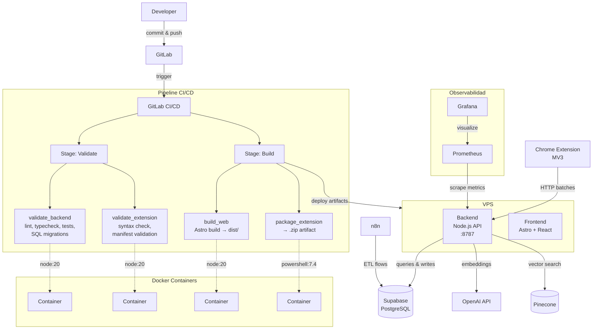

# Diagrama de Arquitectura General

```mermaid
graph TB
    DEV[Developer] -->|commit & push| GL[GitLab]
    GL -->|trigger| CICD[GitLab CI/CD]

    subgraph Pipeline CI/CD
        CICD --> VAL[Stage: Validate]
        CICD --> BLD[Stage: Build]
        VAL --> VB[validate_backend<br/>lint, typecheck, tests,<br/>SQL migrations]
        VAL --> VE[validate_extension<br/>syntax check,<br/>manifest validation]
        BLD --> BW[build_web<br/>Astro build → dist/]
        BLD --> PE[package_extension<br/>→ .zip artifact]
    end

    subgraph Docker Containers
        VB -.->|node:20| D1[Container]
        VE -.->|node:20| D2[Container]
        BW -.->|node:20| D3[Container]
        PE -.->|powershell:7.4| D4[Container]
    end

    BLD -->|deploy artifacts| VPS[VPS]

    subgraph VPS
        BE[Backend<br/>Node.js API<br/>:8787]
        FE[Frontend<br/>Astro + React]
    end

    BE -->|queries & writes| SB[(Supabase<br/>PostgreSQL)]
    BE -->|embeddings| OAI[OpenAI API]
    BE -->|vector search| PC[(Pinecone)]

    EXT[Chrome Extension<br/>MV3] -->|HTTP batches| BE

    N8N[n8n] -->|ETL flows| SB

    subgraph Observabilidad
        PROM[Prometheus] -->|scrape metrics| BE
        GRAF[Grafana] -->|visualize| PROM
    end
```
