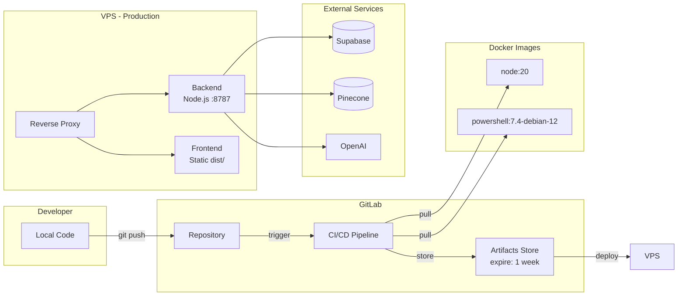

# Diagrama de Despliegue

```mermaid
graph LR
    subgraph Developer
        LC[Local Code]
    end

    subgraph GitLab
        REPO[Repository]
        CI[CI/CD Pipeline]
        ART[Artifacts Store<br/>expire: 1 week]
    end

    subgraph Docker Images
        N20[node:20]
        PS[powershell:7.4-debian-12]
    end

    subgraph VPS - Production
        NG[Reverse Proxy]
        BACK[Backend<br/>Node.js :8787]
        FRONT[Frontend<br/>Static dist/]
    end

    subgraph External Services
        SUP[(Supabase)]
        PIN[(Pinecone)]
        OAI[OpenAI]
    end

    LC -->|git push| REPO
    REPO -->|trigger| CI
    CI -->|pull| N20
    CI -->|pull| PS
    CI -->|store| ART
    ART -->|deploy| VPS
    NG --> BACK
    NG --> FRONT
    BACK --> SUP
    BACK --> PIN
    BACK --> OAI
```
