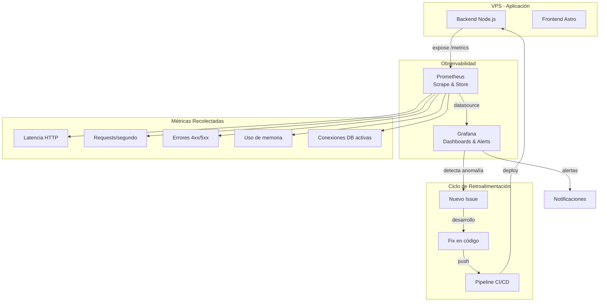

# Diagrama de Monitoreo y Observabilidad

```mermaid
graph TB
    subgraph VPS - Aplicación
        BE[Backend Node.js]
        FE[Frontend Astro]
    end

    subgraph Observabilidad
        PROM[Prometheus<br/>Scrape & Store]
        GRAF[Grafana<br/>Dashboards & Alerts]
    end

    subgraph Métricas Recolectadas
        M1[Latencia HTTP]
        M2[Requests/segundo]
        M3[Errores 4xx/5xx]
        M4[Uso de memoria]
        M5[Conexiones DB activas]
    end

    BE -->|expose /metrics| PROM
    PROM -->|datasource| GRAF
    GRAF -->|alertas| NOTIFY[Notificaciones]

    PROM --> M1
    PROM --> M2
    PROM --> M3
    PROM --> M4
    PROM --> M5

    subgraph Ciclo de Retroalimentación
        GRAF -->|detecta anomalía| ISSUE[Nuevo Issue]
        ISSUE -->|desarrollo| FIX[Fix en código]
        FIX -->|push| PIPELINE[Pipeline CI/CD]
        PIPELINE -->|deploy| BE
    end
```
