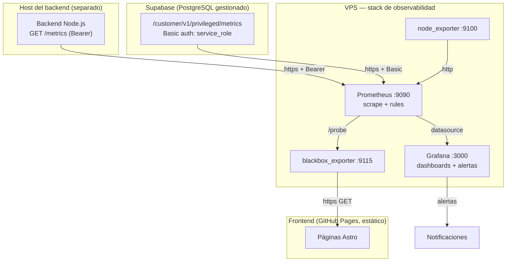
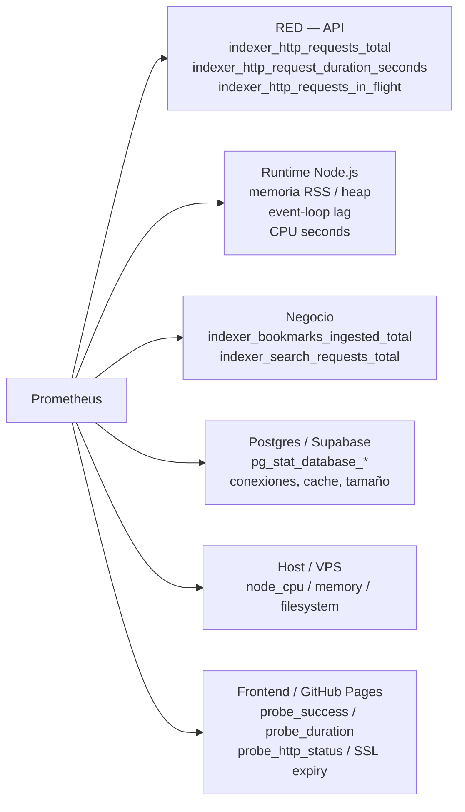
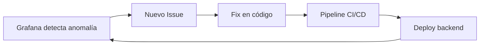

# Diagrama de Monitoreo y Observabilidad

Topología real implementada: el backend corre en un **host separado** del VPS y
se scrapea por internet con token Bearer; Supabase expone su endpoint nativo de
métricas; el host del VPS se monitorea con node_exporter. Detalle completo en
[`../observability.md`](../observability.md).

## Métricas recolectadas

## Ciclo de retroalimentación

