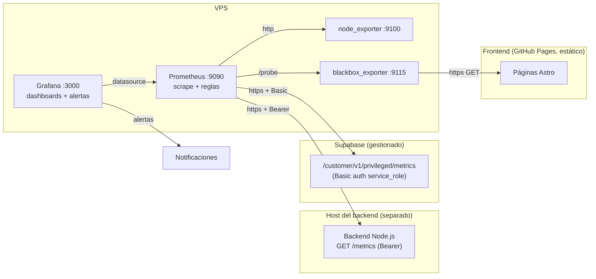

# Observabilidad — Indexer

## Introducción

Este documento describe la **integración real de observabilidad** del proyecto
Indexer con un stack **Prometheus + Grafana** alojado en un VPS. A diferencia de
la mención conceptual en `architecture.md`, aquí se detallan los artefactos
implementados en el repositorio (carpeta [`observability/`](../../observability/))
y la instrumentación añadida al backend.

El objetivo es detectar el mayor número posible de señales del sistema:
rendimiento del API, salud del runtime de Node.js, base de datos PostgreSQL
(Supabase) y el host del VPS.

## Modelo de observabilidad

Se adopta el enfoque de métricas combinando dos metodologías estándar:

- **RED** (Rate, Errors, Duration) para los servicios con tráfico — el API.
- **USE** (Utilization, Saturation, Errors) para los recursos — host y runtime.

| Señal | Pilar | Fuente |
|---|---|---|
| Tasa de requests, errores, latencia | RED | Backend `/metrics` |
| CPU, memoria, event-loop, handles | USE | Backend `/metrics` (runtime Node) |
| CPU, RAM, disco, red del host | USE | node_exporter |
| Conexiones, transacciones, cache, tamaño DB | USE | Supabase (endpoint nativo) |
| Disponibilidad, latencia, SSL del frontend | RED (externo) | blackbox_exporter |
| Métricas de negocio (ingesta, búsquedas) | — | Backend `/metrics` |

## Arquitectura de observabilidad

La topología confirmada: el **backend corre en un host separado** del VPS, por lo
que Prometheus lo scrapea por internet y `/metrics` se protege con un token
Bearer. Supabase es gestionado y expone su propio endpoint de métricas.



## Instrumentación del backend

El backend (servidor `node:http` puro) se instrumentó con un módulo **sin
dependencias** ([`backend/src/metrics.js`](../../backend/src/metrics.js)) que
emite el formato de exposición de Prometheus (`text/plain; version=0.0.4`). No se
añadió ninguna dependencia nueva, preservando el footprint mínimo del proyecto.

Puntos de integración en [`backend/src/server.js`](../../backend/src/server.js):

- Un *listener* `finish`/`close` por request registra las métricas RED de forma
  transversal, sin tocar la lógica de cada endpoint.
- Endpoint `GET /metrics` protegido por `METRICS_TOKEN` (Bearer).
- Incrementos puntuales de métricas de negocio en los handlers de ingesta y
  búsqueda (aditivos; la lógica existente no se modificó).

### Control de cardinalidad

Las rutas dinámicas se normalizan para no generar una serie por cada ID:
`/related/:id`, `/graph/:id`, `/api/github-readmes/:owner/:repo`. Las rutas
desconocidas colapsan a `unmatched`.

## Catálogo de métricas del backend

### RED (HTTP API)

| Métrica | Tipo | Labels | Propósito |
|---|---|---|---|
| `indexer_http_requests_total` | counter | `method`, `route`, `status_code` | Tasa de requests y distribución de estados |
| `indexer_http_request_duration_seconds` | histogram | `method`, `route`, `status_code` | Latencia (permite p50/p95/p99) |
| `indexer_http_requests_in_flight` | gauge | — | Concurrencia en curso |
| `indexer_http_request_errors_total` | counter | `route`, `code` | Errores controlados por código de error de negocio |

### Runtime de Node.js

| Métrica | Tipo | Propósito |
|---|---|---|
| `indexer_process_cpu_seconds_total` | counter | CPU consumida (user+system) |
| `indexer_process_resident_memory_bytes` | gauge | RSS del proceso |
| `indexer_nodejs_heap_size_used_bytes` / `_total_bytes` | gauge | Heap V8 usado/total |
| `indexer_nodejs_external_memory_bytes` | gauge | Memoria de objetos C++ |
| `indexer_nodejs_eventloop_lag_seconds` / `_p99_seconds` / `_max_seconds` | gauge | Saturación del event-loop |
| `indexer_nodejs_active_handles` / `_active_requests` | gauge | Handles/requests libuv activos |
| `indexer_process_uptime_seconds` / `_start_time_seconds` | gauge | Uptime / arranque |
| `indexer_app_info` | gauge | Versión de app y de Node (valor=1) |

### Negocio

| Métrica | Tipo | Labels | Propósito |
|---|---|---|---|
| `indexer_bookmarks_ingested_total` | counter | `source` | Bookmarks insertados por fuente |
| `indexer_ingest_batches_total` | counter | `endpoint`, `status` | Lotes de ingesta procesados |
| `indexer_search_requests_total` | counter | `type`, `strategy` | Búsquedas servidas (search/semantic/goal) |
| `indexer_search_duration_seconds` | histogram | `type`, `strategy` | Latencia de búsqueda reportada por el store |

## Métricas de Supabase / PostgreSQL

Supabase Cloud expone un endpoint Prometheus nativo:

```
https://<PROJECT_REF>.supabase.co/customer/v1/privileged/metrics
```

Autenticación **HTTP Basic**: usuario `service_role`, contraseña = la
**service role key** (JWT). Entrega métricas de Postgres (`pg_*`), pgbouncer,
storage y nodo, sin instalar ningún exporter. Series clave:

- `pg_stat_database_numbackends` — conexiones activas.
- `pg_settings_max_connections` — límite de conexiones.
- `pg_stat_database_xact_commit` / `_xact_rollback` — transacciones.
- `pg_stat_database_blks_hit` / `_blks_read` — cache hit ratio.
- `pg_database_size_bytes` — tamaño de la base de datos.

> Los nombres exactos pueden variar según la versión del proyecto Supabase.
> Verifícalos en Grafana → Explore antes de crear alertas dependientes.

## Métricas del host (VPS)

`node_exporter` aporta las métricas USE del servidor: `node_cpu_seconds_total`,
`node_memory_MemAvailable_bytes` / `node_memory_MemTotal_bytes`,
`node_filesystem_avail_bytes` / `_size_bytes`, `node_network_*`.

## Métricas del frontend (GitHub Pages)

El frontend es un sitio **estático** en GitHub Pages: no hay runtime propio que
exponga `/metrics`. Por eso se monitorea **desde fuera** con `blackbox_exporter`,
que realiza sondas HTTP(S) reales a cada página. Prometheus indica *qué* sondear
y el exporter ejecuta la petición (config en
[`observability/blackbox/blackbox.yml`](../../observability/blackbox/blackbox.yml)).

| Métrica | Tipo | Propósito |
|---|---|---|
| `probe_success` | gauge (0/1) | Disponibilidad de la página (éxito de la sonda) |
| `probe_duration_seconds` | gauge | Tiempo total de la sonda (latencia externa) |
| `probe_http_status_code` | gauge | Código HTTP devuelto |
| `probe_http_duration_seconds` | gauge (`phase`) | Fases: resolve, connect, tls, processing, transfer |
| `probe_ssl_earliest_cert_expiry` | gauge | Epoch de caducidad del certificado TLS |
| `probe_dns_lookup_time_seconds` | gauge | Tiempo de resolución DNS |

Disponibilidad sobre un rango: `100 * avg_over_time(probe_success[$__range])`.
Días para que caduque el certificado:
`(probe_ssl_earliest_cert_expiry - time()) / 86400`.

## Configuración de scrape (Prometheus)

Bloques implementados en
[`observability/prometheus/prometheus.yml`](../../observability/prometheus/prometheus.yml):

```yaml
- job_name: indexer-backend
  scheme: https
  metrics_path: /metrics
  authorization:
    type: Bearer
    credentials_file: /etc/prometheus/secrets/indexer_metrics_token
  static_configs:
    - targets: ["your-backend.example.com"]

- job_name: supabase
  scheme: https
  metrics_path: /customer/v1/privileged/metrics
  scrape_interval: 60s
  basic_auth:
    username: service_role
    password_file: /etc/prometheus/secrets/supabase_service_role
  static_configs:
    - targets: ["YOUR_PROJECT_REF.supabase.co"]

- job_name: node
  static_configs:
    - targets: ["node-exporter:9100"]

- job_name: blackbox-http
  metrics_path: /probe
  params:
    module: [http_2xx]
  static_configs:
    - targets: ["https://your-user.github.io/your-repo/"]
  relabel_configs:
    - source_labels: [__address__]
      target_label: __param_target
    - source_labels: [__param_target]
      target_label: instance
    - target_label: __address__
      replacement: blackbox-exporter:9115
```

## Seguridad

1. `/metrics` exige `Authorization: Bearer <METRICS_TOKEN>` cuando el token está
   configurado (obligatorio al exponerse por internet). Sin token válido → `401`.
2. El token y la service role key viven en `observability/secrets/`
   (**gitignored**); nunca se versionan. Generación y rotación en
   [`secrets/README.md`](../../observability/secrets/README.md).
3. Servir siempre el backend sobre **HTTPS** para no transmitir el token en claro.
4. La service role key se usa únicamente del lado del servidor (Prometheus),
   nunca en el frontend ni en la extensión.

## Alertas

Definidas en
[`observability/prometheus/rules/alerts.yml`](../../observability/prometheus/rules/alerts.yml):

| Alerta | Condición (resumen) | Severidad |
|---|---|---|
| `BackendDown` | `up{job="indexer-backend"} == 0` 2m | critical |
| `BackendHighErrorRate` | ratio 5xx > 5% 5m | critical |
| `BackendHighLatencyP95` | p95 > 1s 10m | warning |
| `BackendEventLoopLagHigh` | lag p99 > 200ms 10m | warning |
| `BackendHighMemory` | RSS > 512 MiB 10m | warning |
| `HostHighCpu` / `HostHighMemory` / `HostLowDisk` | umbrales USE | warning/critical |
| `FrontendDown` | `probe_success == 0` 3m | critical |
| `FrontendSlow` | `probe_duration_seconds > 3s` 10m | warning |
| `FrontendHttpNot2xx` | status fuera de 2xx/3xx 5m | warning |
| `FrontendSslCertExpiringSoon` | certificado caduca en < 14 días | warning |
| `SupabaseScrapeDown` | `up{job="supabase"} == 0` 5m | critical |

## Dashboards

Provisionados automáticamente en la carpeta **Indexer** de Grafana:

- **Indexer — Backend (RED + Runtime)**: tasa de requests, % de error, latencias
  p50/p95/p99, en vuelo, errores por código, memoria, event-loop, CPU e indicadores
  de negocio (ingesta y búsqueda).
- **Indexer — Supabase / Postgres**: conexiones, transacciones, cache hit ratio,
  tuplas y tamaño de la base de datos.
- **Indexer — Frontend (Blackbox uptime)**: estado UP/DOWN por página,
  disponibilidad %, latencia, código HTTP, fases de la sonda y caducidad TLS.

## Runbook (resumen)

1. **`BackendDown`** → comprobar el proceso del backend y que el `METRICS_TOKEN`
   coincida con `secrets/indexer_metrics_token`; probar `curl` a `/metrics`.
2. **`BackendHighErrorRate`** → revisar panel "Handled errors by code" y los logs
   `[backend] request_failed` (incluyen `trace_id`).
3. **`BackendEventLoopLagHigh`** → buscar operaciones síncronas pesadas o lotes de
   ingesta grandes; correlacionar con CPU.
4. **`SupabaseScrapeDown`** → validar la service role key y el `PROJECT_REF`.
5. **`FrontendDown`** → abrir la URL manualmente; revisar el último deploy de
   GitHub Pages (workflow `deploy-pages`) y el panel "HTTP status code".
6. **`FrontendSslCertExpiringSoon`** → certificado gestionado por GitHub Pages;
   normalmente se renueva solo, pero conviene revisar el dominio personalizado.

## Cómo extender la instrumentación

Para añadir una métrica nueva, declárala en `backend/src/metrics.js` (usa
`Counter`, `Gauge` o `Histogram`), expórtala en el objeto `metrics` e
increméntala/observa en el handler correspondiente de `server.js`. Mantén baja la
cardinalidad de los labels.

## Referencias

Ver [references.md](references.md). El diseño sigue los principios de
retroalimentación y telemetría descritos en Kim et al. (Manual DevOps) y la
metodología RED/USE de la comunidad SRE.
