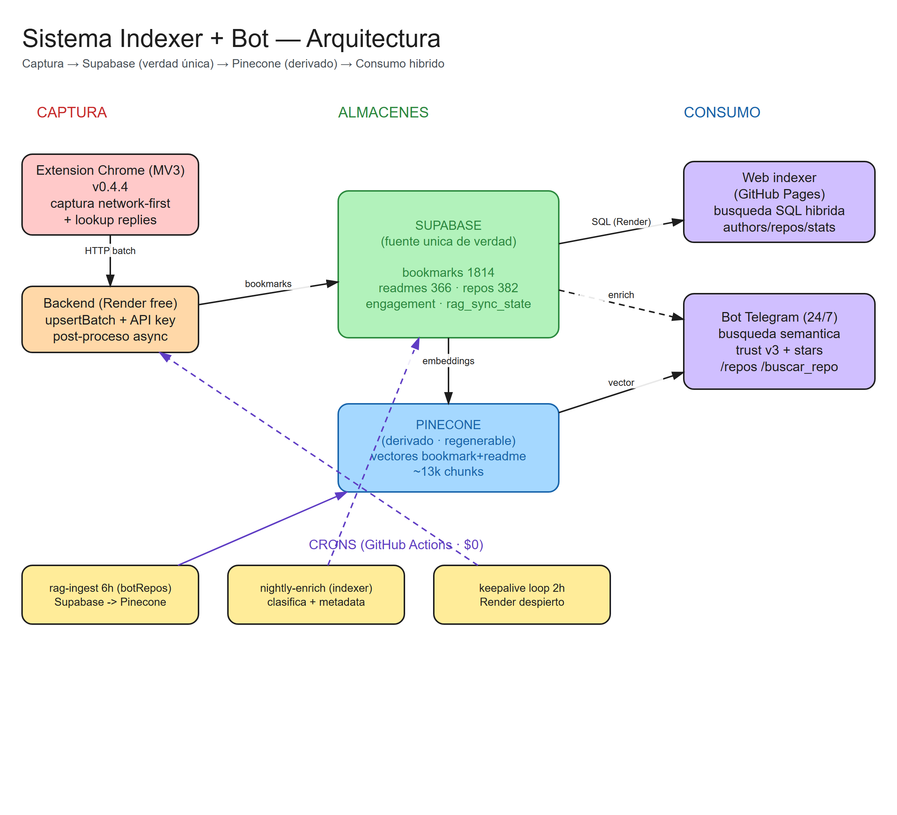
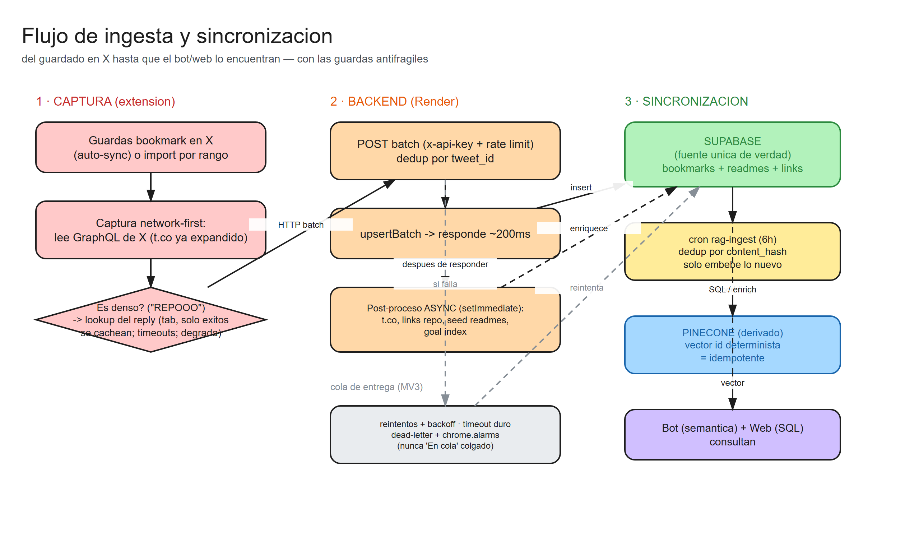

# Diagramas del sistema

Fuente editable en formato Excalidraw (`.excalidraw`, ábrelos en
[excalidraw.com](https://excalidraw.com) → *Open*). El `.svg`/`.png` es el
preview versionado; se regenera desde el `.excalidraw`.

## Arquitectura

Componentes y flujos: captura (extensión) → Supabase (fuente única) →
Pinecone (derivado) → consumo híbrido (web + bot) + crons.

- Editable: [`system-architecture.excalidraw`](./system-architecture.excalidraw)

## Flujo de ingesta y sincronización

Del guardado en X hasta que el bot/web lo encuentran, con las guardas
antifrágiles (captura network-first, lookup de replies, respuesta-luego-proceso,
dead-letter, dedup por content_hash).

- Editable: [`ingestion-flow.excalidraw`](./ingestion-flow.excalidraw)

---

Ver el contrato de arquitectura en [`../../ANTIFRAGILIDAD.md`](../../ANTIFRAGILIDAD.md).
