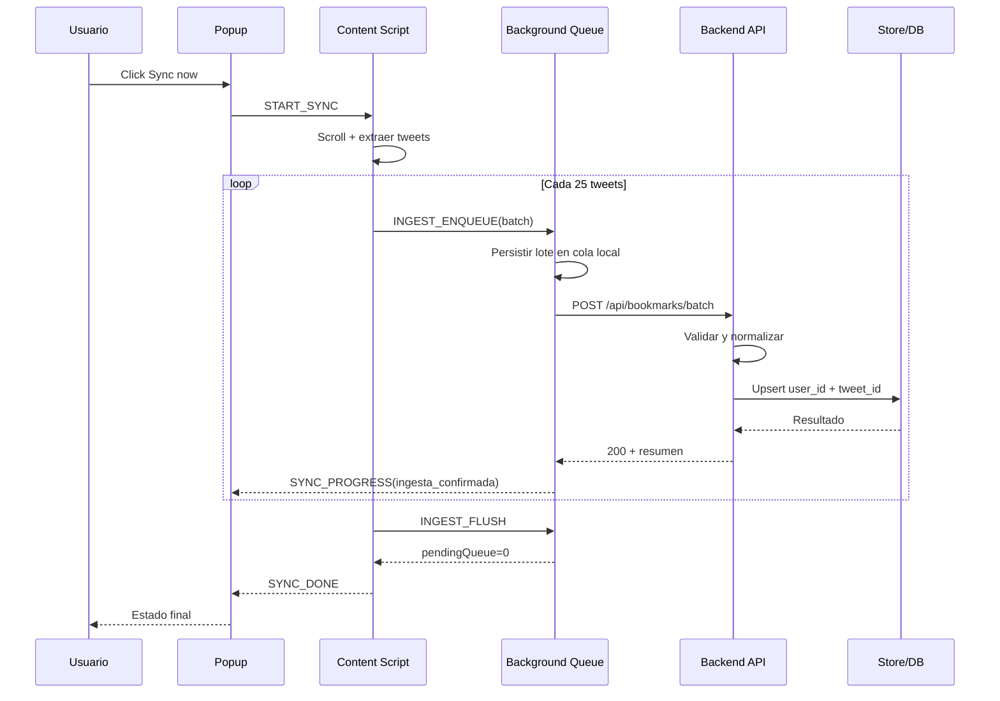
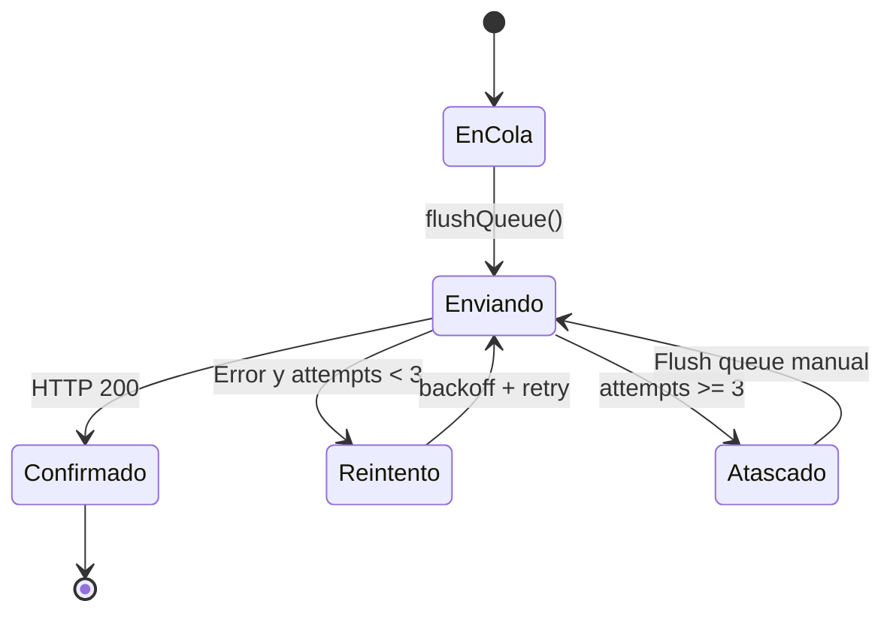

# Funcionamiento del sistema (paso a paso, enfasis en ingesta)

Este documento describe el recorrido completo de los datos desde X hasta almacenamiento y busqueda, con foco en la capa de ingesta.

## 1) Vista general del pipeline

```mermaid
flowchart LR
  A[Usuario en x.com/i/bookmarks] --> B[Extension popup: Sync]
  B --> C[Content script: scraping + scroll infinito]
  C --> D[Batch builder 25 items]
  D --> E[Background queue local]
  E --> F[POST /api/bookmarks/batch]
  F --> G[Backend: validacion y normalizacion]
  G --> H[Deduplicacion user_id + tweet_id]
  H --> I[Persistencia]
  I --> J[Search API]
```



## 2) Paso a paso detallado

1. El usuario abre `https://x.com/i/bookmarks` y pulsa `Sync now` en el popup.
2. `popup.js` envia `START_SYNC` al `content.js` de la pestana activa.
3. `content.js` valida que la URL sea `/i/bookmarks` y crea un `syncId`.
4. Comienza el loop de scroll infinito:
   - Lee nodos `[data-testid="tweet"]`.
   - Extrae `tweet_id`, texto, autor, fecha, links y media.
   - Deduplica en memoria con `Set(tweet_id)`.
5. Cada vez que el buffer llega a 25 items, el content script crea un lote.
6. El lote se envia al background (`INGEST_ENQUEUE`).
7. `background.js` agrega el lote a una cola local persistida en `chrome.storage.local`.
8. El background consume la cola en orden FIFO y envia cada lote a `POST /api/bookmarks/batch`.
9. Si falla la red o el backend, aplica reintentos (`MAX_RETRIES=3`) con backoff.
10. Si un lote supera los reintentos, queda en cola para reintento manual (`Flush queue`) o proximo arranque.
11. El backend valida payload, normaliza campos y realiza deduplicacion por `(user_id, tweet_id)`.
12. El backend responde resumen de `inserted`, `updated`, `ignored_invalid`.
13. Al terminar el scraping, el content script fuerza `INGEST_FLUSH` para vaciar cola.
14. El popup recibe eventos de progreso y muestra estado final de la sync.

## 3) Secuencia completa



## 4) Logica de reintento en ingesta



## 5) Controles criticos de ingesta

- Deteccion temprana de duplicados en `content.js` para bajar trafico.
- Cola persistente en background para tolerar cierres/reloads.
- FIFO estricto para mantener orden de lotes.
- Reintento con backoff para absorber fallos temporales.
- Deduplicacion final en backend por clave `user_id + tweet_id`.
- Lote maximo controlado por backend (`MAX_BATCH_SIZE`, default 50).

## 6) Contrato de ingesta (extension -> backend)

`POST /api/bookmarks/batch`

```json
{
  "user_id": "local-user",
  "sync_id": "sync-1710000000000-ab12cd",
  "batch_index": 4,
  "bookmarks": [
    {
      "tweet_id": "1889900011223344556",
      "text": "example text",
      "author_name": "Example Author",
      "author_username": "example",
      "created_at": "2026-04-11T20:00:00.000Z",
      "links": ["https://example.com"],
      "media": ["https://pbs.twimg.com/media/example.jpg"],
      "source_url": "https://x.com/example/status/1889900011223344556"
    }
  ]
}
```

Respuesta:

```json
{
  "ok": true,
  "user_id": "local-user",
  "sync_id": "sync-1710000000000-ab12cd",
  "received": 25,
  "inserted": 22,
  "updated": 3,
  "ignored_invalid": 0,
  "total_stored": 1240
}
```

## 7) Puntos donde puede romperse y mitigacion

- Cambio de DOM en X:
  - Mitigar aislando selectores y fallback por links `/status/`.
- Picos de rate limit:
  - Mitigar con delay aleatorio y lotes pequenos.
- Red inestable:
  - Mitigar con cola local + reintentos + flush manual.
- Datos incompletos:
  - Mitigar con normalizacion y descarte de payload invalido.