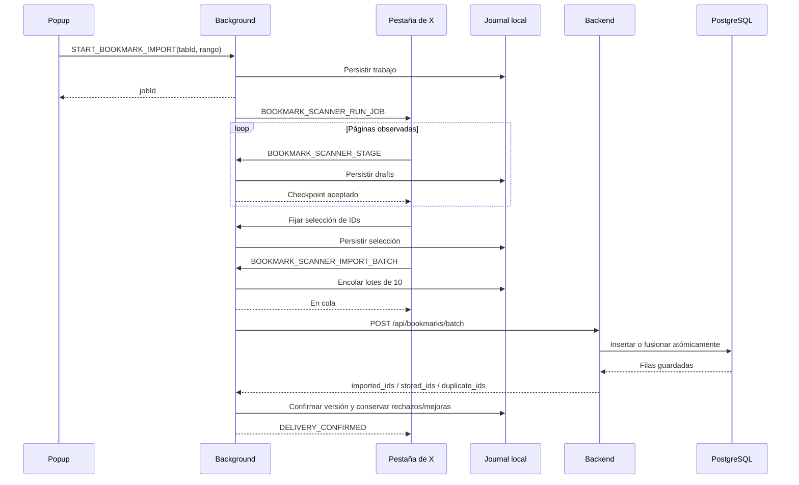

# Ingesta de X Indexer

La extensión 0.5.0 conserva primero la captura en el navegador y elimina la copia pendiente únicamente después de confirmar IDs concretos en el backend. Un éxito de transporte no equivale a un bookmark guardado.


```mermaid
sequenceDiagram
  participant P as Popup
  participant B as Background
  participant C as Pestaña de X
  participant J as Journal local
  participant API as Backend
  participant DB as PostgreSQL
  P->>B: START_BOOKMARK_IMPORT(tabId, rango)
  B->>J: Persistir trabajo
  B-->>P: jobId
  B->>C: BOOKMARK_SCANNER_RUN_JOB
  loop Páginas observadas
    C->>B: BOOKMARK_SCANNER_STAGE
    B->>J: Persistir drafts
    B-->>C: Checkpoint aceptado
  end
  C->>B: Fijar selección de IDs
  B->>J: Persistir selección
  C->>B: BOOKMARK_SCANNER_IMPORT_BATCH
  B->>J: Encolar lotes de 10
  B-->>C: En cola
  B->>API: POST /api/bookmarks/batch
  API->>DB: Insertar o fusionar atómicamente
  DB-->>API: Filas guardadas
  API-->>B: imported_ids / stored_ids / duplicate_ids
  B->>J: Confirmar versión y conservar rechazos/mejoras
  B-->>C: DELIVERY_CONFIRMED
```

## Captura

El puente corre en `MAIN` desde `document_start` y envía mensajes de protocolo 2. En Bookmarks solo interpreta miembros explícitos del timeline: `Tweet`, su envoltorio de visibilidad y módulos de tweets. El autor y el tweet citado son contexto. Un contenedor desconocido se informa como `schema_unknown`.

Se conservan párrafos, URLs de entidades expandidas y hasta 12 000 caracteres, con marca de truncamiento. El DOM complementa la captura. Las entradas desconocidas se reclasifican al recuperar los IDs del backend; un payload de red puede mejorar un draft DOM ya existente.

La captura automática confirma el cambio de estado del botón de X y revalida el ID. La deduplicación temporal se registra después de aceptar el enqueue, permitiendo repetir una captura cuyo almacenamiento falló.

## Persistencia y entrega

`delivery_state_v2` contiene cola, rechazos, drafts por backend/usuario, trabajos, recibos y contadores. Todas las transiciones pasan por una promesa serial y una escritura del registro completo. Memoria solo cambia después de que `chrome.storage.local.set` termina. La migración guarda v2 antes de retirar v1; `unlimitedStorage` permite la coexistencia temporal.

Los mensajes de captura contienen como máximo 40 items y se entregan en lotes de 10. Un job conserva su selección original y cada solicitud compara sus IDs al reutilizar una clave idempotente. Reiniciar el worker no asigna otra captura al mismo número de lote.

Cada fetch JSON tiene un límite de 25 segundos que incluye leer el cuerpo. Una caída de red, 429 o 5xx conserva el lote con backoff exponencial entre 30 segundos y una hora, respetando `Retry-After`. Los errores 400/401/403/413/422 pasan a rechazos mediante la misma escritura que retira el lote activo; no hay límite de 50 ni poda de payloads fallidos. La alarma de un minuto retoma el drenaje.

El ACK se valida por ID. Los IDs omitidos quedan rechazados y una respuesta antigua sin IDs permanece pendiente. Si falla el almacenamiento después del commit remoto, se reenvía el lote; la clave `(user_id, tweet_id)` y el merge permiten repetirlo sin perder contenido.

Una mejora concurrente no se borra con el ACK de una versión anterior: se conserva en drafts y se encola contra `/api/bookmarks/batch` para actualizar el bookmark existente.

## Contratos HTTP

`POST /api/bookmarks/batch` recibe `user_id`, `sync_id`, `batch_index` y `bookmarks`. Responde:

```json
{
  "ok": true,
  "received": 2,
  "stored_ids": ["100"],
  "ignored_invalid": 1,
  "invalid": [{"index": 1, "tweet_id": "200", "reason": "unverified_network_entity"}]
}
```

`POST /bookmarks/import-batch` recibe `user_id`, `source` e `items`. Conserva la semántica de insertar nuevos IDs. Responde `imported_ids`, `duplicate_ids` y `invalid`; los duplicados deben existir en storage, incluyendo una carrera de inserción concurrente. Toda entrega de la extensión usa `/api/bookmarks/batch`, también al importar y reintentar: el merge es necesario cuando un commit anterior pudo completarse sin recibir la respuesta. El endpoint import-batch se conserva para clientes legacy.

Los payloads network incluyen `capture:"network"` y `entity_type:"Tweet"`. Se rechazan URLs de origen incompatibles con el ID, entidades network no verificadas y capturas sin evidencia; arrays de enlaces admiten HTTP/HTTPS.

La migración 017 habilita `merge_bookmark_captures`: conserva el texto más largo, une links/media/autorrespuestas, conserva fechas originales y devuelve las filas fusionadas. La expansión diferida y el PATCH de autorrespuestas usan `append_bookmark_links` para no sobrescribir arrays nuevos con snapshots anteriores. Ambas funciones quedan restringidas a `service_role`.

## Límites operativos

Guardar en PostgreSQL y terminar el enriquecimiento son estados distintos: el pipeline de repos/contextos sigue siendo asíncrono y sus fallos se registran en el backend. Su ejecución durable mediante outbox no forma parte de esta versión.

Cerrar el popup no corta la importación. Cerrar/navegar la pestaña de X puede interrumpir el recorrido; los checkpoints aceptados permanecen. La cobertura solo es completa con evidencia terminal conocida. La identidad configurada de Indexer no identifica la sesión activa de X: para cambiar de cuenta en X, comenzar una nueva pestaña/recorrido y revisar el usuario destino.
