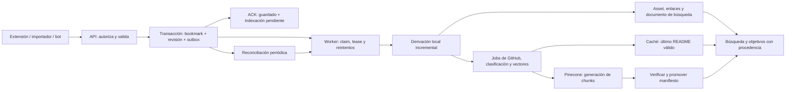

# Plan de robustecimiento de Indexer

**Fecha:** 7 de octubre de 2026, Bogotá. **Estado:** propuesta ejecutable; implementación pendiente. **Base de código:** `a8c4334ac104a97b6bf770beae424a09a42f570f`. **Alcance:** captura, persistencia, índices, búsqueda, objetivos, RAG, operación y experiencia de desarrollo.

Este plan convierte los 25 hallazgos de la [auditoría profunda](/root/audits/indexer-deep-20261006/diagnostico.md) en entregas con dependencias, pruebas y puertas de aceptación. La [matriz de validación](./indexer-validacion.md) especifica cómo comprobarlas. Los nombres de módulos, RPC, tablas y comandos nuevos que aparecen aquí son propuestas; todavía no existen.

## 1. Resultado esperado y límites

Cada captura confirmada debe estar guardada de forma durable, conservar su procedencia y tener una tarea recuperable de indexación. Cada resultado debe identificar su fuente real. La búsqueda debe recorrer el archivo completo con filtros y totales correctos, y las vistas deben terminar en un estado comprensible cuando una dependencia falla.

Se mantienen Node, Supabase/PostgreSQL, Astro/React, la extensión MV3 y Pinecone. Se introduce una cola durable en PostgreSQL y un proceso worker de Node supervisado por el alojamiento. No se requiere una migración de proveedor ni una reescritura de la aplicación. Separar módulos de `store.js` se hará al intervenir cada responsabilidad, evitando un refactor general sin beneficio verificable.

**Supuesto provisional de propiedad:** archivo privado personal; los seis `user_id` actuales se tratan como espacios de importación, no como seis identidades autenticadas. Esta decisión está pendiente de la preferencia del propietario. Se conservarán IDs y particiones; no se fusionarán archivos ni se asignará propiedad por conjetura. La activación de permisos depende de confirmar ese mapa. El resto del plan puede avanzar con scopes explícitos y pruebas de aislamiento.

Quedan fuera de esta ejecución: rediseño visual completo, nuevas funciones comerciales, cambios de modelo LLM por preferencia, cambio de proveedor vectorial y eliminación automática de bookmarks por parecer incompletos. Los cambios productivos se ejecutarán como releases posteriores a este plan, con los controles descritos aquí.

## 2. Línea base verificable

Los siguientes valores pertenecen al snapshot de la auditoría del 6 de octubre. Se volverán a medir antes de reparar datos; no son constantes que deban imponerse a un archivo que puede seguir creciendo.

| Área | Situación observada | Resultado exigido |
|---|---|---|
| Cobertura de objetivos | 462 assets / 1.839 bookmarks; faltan 1.377 | Cada bookmark vigente está derivado a su revisión actual o excluido con motivo visible |
| Búsqueda `react` | ~5.918 ms dentro de PostgreSQL | Presupuesto SQL p95 ≤300 ms en el corpus actual y conjunto de consultas acordado |
| API de búsqueda | Una muestra ~7.989 ms | API caliente p95 ≤1.000 ms; medir también la experiencia desde Bogotá |
| Primer archivo | Datos a ~10,1 s desde navegación, en una muestra recuperada | Disponibilidad caliente medida; arranque/fallo comunicado dentro de 12 s |
| Grafo | 54.605 relaciones; 40.562 por dominio | Eliminar la expansión cuadrática del camino de ingesta; vecinos calculados o materializados con límite explícito |
| Contextos | 250 enlaces faltantes en tabla; 3 sobrantes respecto de arrays | Una representación canónica y conjuntos reconciliados con trazabilidad |
| Repo links | 431 menciones correctas, 390 repos; 87 assets pierden referencias | Conservar menciones y derivar metadata concordante |
| Calidad | 4 textos contaminados; 93 entradas `blob:` | Contenido seleccionado verificable y medios temporales señalados, sin falsa relevancia |
| Clasificación | 195 filas de evidencia redundantes | Unicidad por evidencia/versión y reemplazo transaccional |
| RAG | 13.743 estados locales; presencia externa no verificada | Manifiestos reconciliados contra vectores y fuentes vigentes |
| Release | Ausencia probada de migración 017; commit de Render desconocido | Commit, capacidades y versión de esquema comprobables |

Las muestras de la auditoría no son percentiles. Los SLO de este plan son objetivos de aceptación que deben medirse. La ausencia de 017 está demostrada. Al preparar este plan se comprobó que el cuerpo desplegado de `search_bookmarks` coincide con 012 después de normalizar whitespace, y se corrigió esa afirmación del informe. Cualquier otra divergencia se verificará mediante definiciones y fingerprints, sin asumir que una migración falta solo por su número o nombre.

## 3. Invariantes que deben guiar todos los cambios

1. **ACK durable:** un ID confirmado implica commit del bookmark y registro durable del trabajo necesario. No implica que GitHub, clasificación o vectores hayan terminado.
2. **Una revisión autorizada:** una tarea calculada sobre la revisión `r` solo puede publicar derivados si la fuente sigue en `r`. Un resultado antiguo nunca reemplaza uno nuevo.
3. **Derivación atómica:** enlaces, asset y estado de derivación de una revisión se publican en una transacción. Un error conserva la revisión publicada anterior.
4. **Identidad y evidencia:** un README asociado a un post debe tener vínculo real con ese post. Un repo encontrado globalmente es un resultado independiente.
5. **Calidad sin pérdida silenciosa:** se conserva la captura original de forma acotada y una explicación del contenido seleccionado. Más caracteres no equivalen a mejor contenido.
6. **Scope obligatorio:** toda lectura, contador, job y recuperación tiene un corpus autorizado. Un `user_id` enviado por el cliente no concede acceso.
7. **Totales honestos:** `page_size`, total de coincidencias y tamaño de candidatos son conceptos distintos. Un modo parcial declara su límite y su alcance.
8. **Último estado válido:** una caída externa no borra el último README bueno ni declara sincronizado un vector que no se escribió.
9. **Borrado efectivo:** una fuente eliminada deja de ser recuperable inmediatamente en la capa de autorización/hidratación; la limpieza externa se completa de forma durable.
10. **Operación verificable:** todo job tiene estado, intentos y causa de fallo; todo release declara commit y contrato de esquema.

## 4. Arquitectura propuesta



### 4.1 Contrato de captura y revisión

Mantener los IDs actuales. Añadir una revisión monotónica `bigint` administrada por la DB cuando cambien campos que afectan a derivados: contenido seleccionado, autor, fecha, URLs persistibles, contextos y política de visibilidad. No usar `updated_at` como control de concurrencia. Distinguir revisión de contenido, fecha del post, fecha de ingesta y última comprobación externa.

Actualizar la escritura atómica de [017](../../backend/sql/017_preserve_bookmark_capture.sql) mediante una migración nueva. La política de selección combinará procedencia, identidad verificada, completitud y calidad. Un texto limpio más corto podrá sustituir contaminación documentada; un texto largo auténtico no se recortará por ese criterio. Las correcciones manuales tendrán prioridad explícita. Las URLs válidas se unen de forma estable; retiros deliberados necesitan una operación explícita y revisión, no el merge de una captura parcial.

Guardar variantes distintas por hash con fuente, versión de extractor y motivos de selección/rechazo. Retención inicial propuesta: como máximo cinco variantes por bookmark, con límite de tamaño por captura; las versiones reemplazadas por una reparación se conservan además en el registro de mantenimiento hasta vencer su retención. No conservar HTML completo, cookies, tokens ni cuerpos de red ajenos al post. El contenido multimedia sin texto sigue siendo válido; `blob:` se registra como medio no recuperable y no entra en dominios, FTS o embeddings.

Inventariar todos los escritores: API, `migrate.js`, scripts de backfill, extensión y bot-repos si escribe en las mismas tablas. `migrate.js` no seguirá insertando JSON directamente sin el contrato de validación. Un trigger transaccional de revisión/outbox cubre también escritores compatibles que usen SQL directamente; no sustituye la autorización ni la normalización del contenido. Revocar escrituras incompatibles solo después de migrar sus clientes.

La respuesta de ingesta conserva el ACK por ID que usa la extensión y añade revisión/estado. Para un reenvío idéntico se confirma la misma fila sin multiplicar jobs. Si no puede persistirse el trabajo de una nueva revisión, la transacción falla y no se devuelve un ACK falso.

### 4.2 Outbox y worker

Tabla propuesta `pipeline_jobs`:

| Campo | Uso |
|---|---|
| `id`, `source_type`, `source_id`, `corpus_id` | Identidad y scope; incluir tipos de fuente explícitos |
| `target_revision`, `pipeline_version`, `phase` | Versión concreta del trabajo |
| `state`, `available_at`, `attempts` | `pending`, `leased`, `retry`, `succeeded`, `failed`, `superseded` |
| `lease_token`, `lease_until`, `worker_id` | Exclusión temporal y protección ante workers antiguos |
| `last_error_code`, `last_error_at`, `trace_id` | Diagnóstico sin contenido privado ni secretos |
| `created_at`, `finished_at` | Lag, duración y retención |

Unicidad por fuente, revisión, fase y versión del pipeline; índice parcial sobre estados reclamables/`available_at`. El claim usa una RPC con bloqueo de filas y `SKIP LOCKED`, apropiado para consumidores de una cola; no se usará para lecturas normales del archivo. [PostgreSQL 17: SELECT](https://www.postgresql.org/docs/17/sql-select.html).

Un worker separado reclama pocas tareas, obtiene un token nuevo y libera la transacción antes de hacer llamadas externas. El commit de resultados comprueba token vigente, lease y revisión actual en una sola transacción. Si la revisión cambió, marca la tarea antigua como `superseded` y garantiza una tarea para la vigente. El worker que perdió su lease no puede completar ni modificar una tarea reclamada por otro.

Configuración inicial para staging: concurrencia local 4; GitHub/LLM 2; embedding 2; lease local 30 s y externo 90 s, con renovación controlada. Reintentos de red/429/5xx con jitter, inicio 2 s, máximo 5 min y ocho intentos automáticos; errores permanentes quedan visibles. El operador puede reencolar después de corregir la causa. No se promete ejecución única: se garantiza idempotencia sobre entrega al menos una vez.

Separar fases: `derive_local`, `fetch_readme`, `classify_repo`, `sync_vectors`, `delete_vectors`. La derivación local no depende de GitHub/OpenAI. Los jobs dependientes se crean al publicar su entrada válida; un error de clasificación no bloquea la cobertura básica. Desactivar el pipeline antiguo con `setImmediate` antes de permitir publicaciones nuevas. En staging puede calcularse en sombra, pero solo un camino escribe los derivados.

No eliminar jobs al borrar una fuente: un tombstone debe conservar IDs de vectores/manifiestos y trabajo de limpieza. El reconciliador compara revisión requerida/publicada y crea solo tareas ausentes. Terminales conservados 30 días como propuesta inicial; fallidos permanecen hasta resolución o archivo operativo explícito.

Jobs, claims, commits y reparación son recursos de servidor: sin grants a `anon`, con roles/grants explícitos y `search_path` fijo en funciones privilegiadas. Un cliente no puede reclamar o completar un job enviando un ID/token propio. Mientras se introduce el modelo `corpora`, el scope de la cola conserva la partición `user_id` existente; no interpreta ese string como identidad autenticada.

### 4.3 Derivados y relaciones

Extraer repos y contextos desde la representación canónica con fixtures compartidos JS/PostgreSQL. Corregir la regex SQL mediante migración nueva; cubrir URL simple, `.git`, query, fragmento, puntuación de cierre, mayúsculas y comentarios. Los 431 vínculos correctos actuales son evidencia a conservar y contrastar, no filas que deban borrarse por el parser roto.

Crear una RPC `commit_bookmark_derivation` que valide revisión/lease, reemplace los conjuntos de contextos y repo links, publique el asset y marque el job terminado en la misma transacción. Añadir revisión de origen y versión de derivador a cada derivado. Introducir claves compuestas que comprueben `(bookmark_id, user_id)` y `(asset_id, user_id)` donde hoy una FK solo comprueba existencia. No reasignar propietarios para hacer pasar una restricción.

El camino normal procesa IDs cambiados; no llama a `refresh_goal_search_index(userId)` para reconstruir el usuario entero. Las relaciones de autor/repo/dominio se consultan con índices o se resuelven como vecindad acotada. No materializar cliques por `x.com`, `twitter.com` o dominios temporales. Si una pantalla necesita vecinos precalculados: máximo inicial 20 aristas salientes por asset, orden y motivo reproducibles, revisión de origen; el total materializado queda acotado por `20 × assets`. Las menciones explícitas bookmark → repo/contexto no se recortan a ese límite.

Conservar el grafo histórico mientras se valida la nueva consulta. El retiro posterior de relaciones redundantes es una operación de mantenimiento con diff y recuperación, no parte del ACK de cada ingesta. Reconciliación periódica y métricas detectan cualquier nueva diferencia.

### 4.4 Búsqueda y contrato de resultados

Persistir documento normalizado, `tsvector`, versión de normalizador y revisión de origen; poblarlo por lotes y mantener nuevas escrituras con el contrato transaccional. Crear GIN para FTS y escoger GIN/GiST trigram según planes medidos. Separar recuperación FTS, prefijo y substring/fuzzy en ramas indexables; rankear la unión de IDs y calcular highlights solo para la página retornada.

No mantener `word_similarity(...) >= ...` como filtro sobre todo el corpus. Evaluar operadores indexables como `<%` con orden correcto de argumentos y umbrales locales a la transacción. La semántica fuzzy puede cambiar: se comparará contra consultas anotadas antes de activar. No presentar la prueba FTS de 8,8 ms como sustitución equivalente del buscador completo. [PostgreSQL 17: pg_trgm](https://www.postgresql.org/docs/17/pgtrgm.html).

Browse sin texto usa filtros e índice por corpus/fecha/ID, sin ranking textual. Aplicar medios, enlaces, autor, dominio y fecha antes de paginar. `sort=recent` llega hasta SQL. Definir una fecha de orden persistida —fecha del post, o ingesta cuando falta— y mantener la etiqueta de fecha real separada; empates resueltos por ID.

Contrato propuesto compatible con los endpoints actuales durante transición:

```json
{
  "items": [],
  "page_size": 50,
  "matched_total": 1839,
  "total_is_exact": true,
  "next_cursor": "opaque",
  "partial": false,
  "scope": { "corpus_ids": ["authorized-corpus"] },
  "index": { "version": "search-v2", "pending": 0 },
  "trace_id": "request-id"
}
```

`total` heredado seguirá representando coincidencias, nunca `items.length`. En página vacía se obtiene el total de forma independiente. El cursor firmado/versionado contiene consulta/filtros/scope, orden, última clave y versión del índice; se rechaza si cambia la consulta. Para búsquedas rankeadas se mantiene un snapshot de IDs/orden con TTL corto en DB, acotado por usuario, para evitar saltos bajo escrituras concurrentes. Browse mantiene paginación estable dentro de una marca de agua de ingesta y declara que no es un snapshot transaccional de ediciones concurrentes.

El modo ordinario no recorta candidatos antes de calcular coincidencias y total. Si una consulta amplia exige degradación por presupuesto, retorna `partial:true`, motivo y `total_is_exact:false`, con límite documentado; no anuncia que cubre todo el archivo. No se inventa un total exacto a partir de los primeros 200 candidatos.

### 4.5 Objetivos, relevancia y procedencia

Resultado tipado: `bookmark` o `repository`, ID estable, título de la fuente, URL canónica, evidencia propia, repos asociados mediante FK y revisión. Un repo globalmente relevante aparece como sugerencia independiente. El mapper y `GoalPipelineView` no pueden sustituir el nombre del post por un README encontrado por similitud.

Mostrar relevancia ordinal o score explicado, sin transformarlo a 70–99 % de confianza. `github_stars` procede de metadata real, con fecha de actualización, o se omite. Cobertura de pasos = pasos con evidencia válida / pasos requeridos; calidad/ranking de una ruta es otro campo. Cada explicación referencia texto de una fuente autorizada relacionada, no solo una frase generada.

La cobertura del índice se calcula por corpus/revisión y es visible durante el backfill. Un objetivo con corpus incompleto lo declara. El modo SQL de objetivos y el RAG de Pinecone comparten DTO de procedencia/visibilidad aunque conserven algoritmos diferentes. No se anunciará búsqueda semántica activa cuando el modo vigente sea `semantic_lite_v1` sin embeddings.

### 4.6 Caché GitHub y clasificación

Mantener `last_good_content`, hash/revisión de contenido y metadata real por repo. Separar `last_fetch_at`, error de descarga, estado de frescura y reintento. Una respuesta 404 o un timeout no vacía una caché válida; un 404 sin histórico usa caché negativa temporal y motivo explícito. Distinguir la marca de comprobación del README de la revisión que invalida clasificación/vectores.

GET de lista/detalle sirve caché y no inicia escrituras ni LLM. La ingesta y el planificador crean el refresh cuando corresponde; una acción autenticada de refresh crea una tarea y responde con estado. Dedupe por repo/ventana de frescura y lease. Veinte lecturas concurrentes no generan trabajo externo; veinte solicitudes equivalentes de refresh generan un único trabajo activo.

`commit_repo_classification` publica clasificación y evidencia en una transacción, compara hash de README y usa la versión efectiva del resultado (`v1` o `v3`). Clave única de evidencia: repo, revisión de contenido, versión de clasificador y fingerprint canónico de tipo/valor/fuente. Los historiales intencionales se almacenan como snapshots separados. No usar la constante v1 para borrar evidencia de un resultado v3.

### 4.7 RAG: manifiestos y generaciones

Inventariar primero host, índice, namespace, modelo, dimensión, chunker y consumidores reales —incluido el bot—. No borrar vectores de un índice compartido sin poder atribuirlos a Indexer. No asumir que `rag_sync_state` acredita presencia externa.

Añadir `rag_sources`, `rag_generations` y `rag_chunks`, o una ampliación equivalente que conserve compatibilidad con el estado actual. Fuentes tipadas y claves verificadas a bookmark/README; revisiones, visibilidad y tombstone en la fuente. Manifiesto con hash de contenido, modelo, dimensión, versión de chunker, namespace, IDs esperados y estado por chunk. La generación nueva tiene IDs propios: `source/generation/chunk`. Se conserva el manifiesto cuando se retira la fuente para poder limpiar el índice externo.

Secuencia obligatoria:

1. Leer fuente/revisión y crear manifiesto pendiente idempotente.
2. Generar embeddings por lotes con límites; comprobar dimensión devuelta, modelo efectivo e índice destino. Corregir la resolución de configuración de `rag-openai.js` para que un argumento por defecto no ignore el modelo configurado.
3. Upsert en Pinecone y comprobar error/ACK.
4. Verificar presencia de IDs de la generación con reintentos limitados; separar aceptación de escritura de visibilidad de consulta según el comportamiento comprobado del índice/SDK.
5. Promover `active_generation` en DB solo si todos los chunks están listos y la revisión sigue vigente. Registrar y comprobar también errores de Supabase.
6. Encolar eliminación de generaciones anteriores y retirar sus estados después de confirmar limpieza. Reejecutar no duplica embeddings ya verificados.

Durante una actualización ordinaria, la generación anterior puede servir como última versión válida con indicador de revisión/frescura; la capa de hidratación comprueba existencia y permiso actuales. Una corrección de contaminación invalida esa generación para recuperación inmediatamente: no seguir sirviendo embeddings del CSS mientras se reconstruyen. Ante borrado o retirada de permiso, la fuente se oculta inmediatamente aunque la limpieza de Pinecone tarde. RAG descarta fuentes inexistentes, no autorizadas y generaciones no activas; deduplica por recurso y hace overfetch acotado para completar topK. Si no puede completar, declara parcialidad.

El borrado gestionado crea el tombstone y encola limpieza antes de retirar la fuente física. Las FK/manifiestos no pueden hacer cascade y perder los IDs necesarios para limpiar. La reconciliación detecta un borrado externo incompatible y conserva los IDs conocidos, pero no convierte ese bypass en un camino soportado.

Separar corpus privados mediante namespaces/scopes definidos; los READMEs públicos compartidos se hidratan a través de los repos autorizados o de un catálogo público explícito. No convertir metadatos vectoriales en autorización. La documentación de Pinecone recomienda IDs estructurados y namespaces para separar tenants; el diseño exacto se elegirá tras inventariar el índice actual. [Pinecone: production checklist](https://docs.pinecone.io/guides/production/production-checklist).

Recorrer todas las fuentes con cursor/checkpoint, sin una lectura única de 2.000/500. El estado heredado queda como `unverified` hasta reconciliación; no forzar una reembedding completa si vectores/modelo/contenido válidos pueden verificarse. Cambiar dimensión exige destino compatible y transición de lectores, nunca mezclar vectores incompatibles en el mismo índice.

### 4.8 Cliente, permisos y operación

Centralizar HTTP en `web-astro/src/lib/api.ts`: error tipado con status, code, retryable y trace; `AbortSignal`; deadline total. Default inicial de lecturas: 12 s total, como máximo un retry de GET dentro de ese presupuesto. 400/401/403/404 no se reintentan; 429 respeta `Retry-After` si cabe; cancelación por cambio de consulta no muestra error. Escrituras solo se reintentan con operación/IDs idempotentes.

Cada componente aplica abort y generación de solicitud a resultado, error y loading. La clave incluye corpus, consulta, filtros, orden y página. La respuesta de otra generación se descarta aunque el transporte no pueda abortarse. Health tiene un solo sondeo en vuelo y pausa cuando la página no está visible. Conservar último resultado solo con etiqueta de su consulta y revisión; nunca rotularlo como respuesta a una nueva.

Para archivo privado: Supabase Auth, sesión web y extensión, credencial de servicio separada para bot/importador, autorización de principal → corpus en backend y RLS aplicable. Verificar firma/emisor/expiración con biblioteca, usando JWKS si el proyecto tiene claves asimétricas y validación de Auth para su configuración real. La documentación advierte que JWKS no devuelve claves con firma simétrica; este preflight es obligatorio. [Supabase: JWTs](https://supabase.com/docs/guides/auth/jwts).

El backend con service-role no queda protegido automáticamente por RLS: todas sus operaciones deben pasar por resolución de scope autorizada, también stats, listados, catálogo asociado, jobs y RAG. No colocar service-role ni PAT en web/extensión. Si se elige archivo público, se publica un corpus declarado mediante rol de solo lectura; escrituras y mantenimiento siguen autenticados y los corpus privados quedan fuera.

`/health` mide vida del proceso, sin contar todo el archivo; `/readyz` comprueba conexión/contrato esencial de DB. Una caída de OpenAI no invalida una API que puede guardar/buscar localmente. `/version` o equivalente expone commit/build, versión de API, esquema y capacidades sin secretos. Estado de indexación por corpus y administración de jobs requieren autorización.

## 5. Entregas y dependencias

Cada paquete debe ser un PR revisable con migración/código compatibles y evidencia de aceptación. Las estimaciones son jornadas de un ingeniero, incluyendo pruebas y documentación del paquete; no son fechas ni compromisos. Accesos ausentes y espera de proveedores se contabilizan aparte.

| ID | Entrega y cambios principales | Dependencias | Jornadas |
|---|---|---|---:|
| P00 | Preflight de writers/infra/esquema, fixtures, release ledger y SLO inicial | — | 1–2 |
| P01 | Corrección visible: identidad, estrellas/cobertura, carreras, HTTP y total actual | P00 | 1–2 |
| P02 | Captura con calidad, revisión, outbox transaccional; importador compatible | P00 | 2–3 |
| P03 | Worker, leases, reintentos y publicación derivada atómica; parser y grafo incremental | P02 | 3–4 |
| P04 | Búsqueda indexada, browse, cursores, filtros y resúmenes SQL | P03 | 2–4 |
| P05 | README durable, refresh fuera de GET, clasificación/evidencia atómica | P03 | 2–3 |
| P06 | RAG con manifiesto, generación, ACK correcto, scope y limpieza | P03, P05 | 3–4 |
| P07 | Propiedad/permisos, cliente de extensión/bot y catálogo visible | P02 + decisión de propiedad | 2–4 |
| P08 | Reparación histórica y reconciliación reanudable; habilitar corpus completos | P03, P04, P05, P07 | 2–3 |
| P09 | Observabilidad, operación periódica, instalación/deploy y validación final | P01, P04, P05, P06, P07, P08 | 2–3 |

**Estimación total: 20–32 jornadas.** Es una suma de trabajo, no incluye esperas ni demuestra que la implementación esté validada. El rango alto cubre ajustes de concurrencia y transición de consumidores. Un cambio de alcance a múltiples usuarios puede añadir trabajo de onboarding/administración fuera de este rango.

P01 proporciona alivio temprano. P04/P05/P07 pueden desarrollarse de forma independiente tras sus prerrequisitos, pero se activan conforme a las puertas de release. P08 no requiere terminar vectores: repara primero el corpus local; la reconciliación vectorial de P06 tiene su propia puerta y presupuesto.

### P00 — Preparar evidencia, releases y entorno reproducible

- Confirmar commits reales de Pages/API, servicios activos, reinicios, región y cron/worker disponibles en Render; correlacionar logs con la indisponibilidad observada. No contratar capacidad antes de medir arranque/consulta.
- Inventariar tablas, funciones/RPC, índices, grants, RLS y escritores externos; comparar con 001–017. Probar el contrato de 017 en staging antes de activar un backend que lo exige.
- Introducir runner de esquema con historial/checksum/fingerprint y comandos separados para importar datos. Adoptar un esquema antiguo solo tras introspección; no marcar todas las migraciones como aplicadas por existir sus archivos.
- Fijar una versión de Node soportada y comprobada con el suite actual para Docker, CI y desarrollo; no elegirla solo por el número más alto instalado.
- Crear dataset anonimizado para integridad/ranking y un corpus sintético de 10.000 registros. Reusar reproducciones de auditoría como entrada de regresiones estables.
- Crear baseline de benchmark, checklist de release y feature flags. Comprobar backup y ensayo de restauración en staging.

**Puerta:** matriz de escritores/capacidades completa; staging arranca con contrato verificado; deploy puede identificar sus componentes; rutas de respaldo/restauración probadas. Código principal: `server.js`, `config.js`, scripts y workflows.

### P01 — Recuperar corrección visible y recuperación de la UI

- Corregir `GoalPipelineView` y mapper para conservar identidad y procedencia; quitar estrellas/confianza fabricadas y separar cobertura de relevancia.
- Corregir el total perdido de `store.search`, `sort` y errores ignorados; respetar respuestas vacías con total real.
- Añadir HTTP tipado/deadlines y generación/abort en SearchApp, GoalPipelineView, ReposList, AuthorsList, RepoReadmesList y Sidebar.
- Definir estados de carga/error/último dato conocido e informar cobertura real de objetivos.

**Puerta:** carrera old/new reproducida deja la consulta nueva; cambio de corpus no filtra datos antiguos; ningún 401 se reintenta; la tarjeta Tabularis mantiene identidad; 3/3 pasos significa 100 % y score 0 no se transforma en confianza. No se declara resuelta la paginación completa hasta P04.

### P02 — Establecer escritura durable y calidad

- Añadir revisión, captura seleccionada/procedencia y outbox con triggers/RPC; probar reenvíos, conflicto y rollback de la transacción.
- Sustituir importaciones directas y validar ownership sin cambiar IDs históricos. Hacer preflight de capabilities al iniciar el backend.
- Mantener compatibilidad del ACK de la extensión y sus journals; probar cambio de cuenta X/corpus durante un trabajo. La sesión autenticada que captura, el archivo destino y el job deben quedar fijados por ejecución; si cambia el visor, pausar y revalidar antes de continuar.
- Los datos históricos quedan como `legacy/unverified`; no se inventa `network` ni `complete` para importaciones antiguas.

**Puerta:** no existe ACK sin fila + job, no crecen jobs en reintentos idénticos, una corrección limpia no pierde texto auténtico y un writer compatible no evita el trigger. No activar todavía backfill masivo ni publishers antiguos simultáneos.

### P03 — Publicar derivados sin carreras ni grafo cuadrático

- Introducir módulos `pipeline/*`, worker y repositorios de derivación al extraerlos de `store.js`.
- Implementar claim/lease/heartbeat y commit con comparación de revisión; ejecutar fallos controlados de proceso y dos workers.
- Corregir parser SQL y unificar fixtures con parser JS; RPC transaccional de contextos/repos/assets.
- Reemplazar refresh por usuario completo con delta por IDs y relaciones calculadas/acotadas; claves de propiedad compuestas y reconciliador.

**Puerta:** matar worker en cada frontera recupera tareas; A/B fuera de orden termina en B; un error entre reemplazos no deja vacío; 10 ingestas nuevas no reconstruyen los seis archivos; un corpus de 10.000 no genera `n(n−1)/2` aristas. Mantener cobertura/histórico sin afirmaciones falsas durante transición.

### P04 — Reducir latencia y recorrer el archivo completo

- Documento normalizado versionado, índices nuevos y RPC de búsqueda separada de browse; comparar planes y ranking.
- Cursores/snapshot de búsqueda, total verdadero, filtros en DB y orden reciente; paginación visible en archivo/README.
- Agregados SQL de autores/repos/stats con definición compartida de autor desconocido y scope; hidratar solo páginas necesarias, eliminar full scans por petición.
- Configurar timeout de consulta, presupuesto de respuesta y modo parcial declarado; evitar enviar contenido de README completo en listados.

**Puerta:** benchmark de la matriz de validación aprobado; filtros encuentran registros después de la primera página; navegación de los 403 READMEs del snapshot; stats y vistas concuerdan; no cambia relevancia silenciosamente por caps.

### P05 — Proteger README y evidencia

- Refactor de `github-readmes.js`, `repo-classifier-llm.js` y almacenamiento: último contenido bueno, hash real, refresh durable y tiempos límite.
- Endpoint autorizado de refresh, caché negativa/backoff y dedupe; GET sin descarga/LLM ni mutaciones.
- RPC de clasificación + evidencia idempotente y constraints de unicidad. Duplicados históricos permanecen hasta diff de P08, o se migran con snapshot si la constraint lo requiere antes.

**Puerta:** caída GitHub conserva caché, veinte lecturas no lanzan refresh, refresh simultáneo se deduplica, ejecutar v3 dos veces no crece evidencia, fallo intermedio no publica una clasificación incoherente.

### P06 — Hacer comprobable la sincronización vectorial

- Manifiesto/generación por fuente, cursores/checkpoints y procesamiento por lotes; sin flags/hash interpretados como ACK antes de escritura.
- Validación de configuración modelo/dimensión, retry de proveedores y promoción CAS; limpiar solo IDs/namespace atribuidos al proyecto.
- Recuperación autorizada y deduplicada, tombstones, limpieza y reconciliación. Actualizar CLI/Telegram y bot-repos si comparten el índice.
- Estimar antes de ejecutar tokens/chunks y gasto con configuración real; techo operativo diario configurable y pausa de jobs facturables al alcanzarlo, conservando los pendientes.

**Puerta:** fallo de upsert no confirma estado; upsert válido seguido de caída DB se recupera sin pérdida; 3 → 1 elimina sobrantes; eliminación de fuente la oculta antes de limpieza; modelo incompatible falla en preflight. Presencia/cobertura productiva se acredita con inventario, no con contador local.

### P07 — Aplicar el modelo de propiedad

- Confirmar propietario de los seis corpus y modo público/privado. Añadir `corpora` y `corpus_members` o equivalente preservando `user_id` legado.
- Autenticar web/extensión/bot según tipo de cliente; mapear principal a corpus permitido en todos los handlers/store/RAG.
- Migrar clientes antes de retirar compatibilidad; cambiar scope invalida caches locales, requests pendientes y trabajos de captura ligados a otra sesión.
- Verificar RLS/grants y rutas con credenciales de servicio; API keys de escritores con scope, no claves universales embebidas en clientes públicos.

**Puerta:** usuario A no lee/escribe corpus B por URL, cuerpo, cursor o RAG; jobs operan con corpus fijado; modo público solo publica corpus declarados. La activación espera un mapa de propiedad confirmado; no bloquea P01–P06.

### P08 — Reparar datos después de cerrar sus causas

Ejecutar el procedimiento de la sección 7. Cada cambio utiliza revisión/hash de origen; filas editadas durante el mantenimiento se reevalúan. Reconciliar primero el corpus local y después los manifiestos RAG bajo P06. Mantener las 1.839 fuentes del snapshot, salvo decisiones explícitas sobre registros concretos; las exclusiones son un estado, no un borrado.

**Puerta:** cobertura local por revisión completa, cero drift no explicado, sin duplicados de evidencia, procedencia correcta y reporte de antes/después por los seis corpus. No usar el antiguo refresh masivo como herramienta de reparación.

### P09 — Operación diaria y DX comprobable

- Métricas/alertas y dashboards extendiendo la infraestructura Prometheus/Grafana actual; heartbeat de worker y tareas programadas.
- Mantenimiento supervisado que no depende del keepalive: reconciliación, reintentos y frescura. Si sigue GitHub Actions, comprobar estado activo y reportar cada fase; un fallo RAG no queda oculto por `continue-on-error`.
- Configurar alojamiento/API para el presupuesto de arranque medido. Documentar instancia/worker necesarios y decisiones de coste con datos reales.
- README, CONTRIBUTING, changelog y runbooks; scripts de root con workspace correcto, demo offline, preflight legible y descarga de Playwright solo cuando se necesita.
- CI con PostgreSQL real para locks/transacciones, pruebas HTTP/contratos y navegador para carreras. Separar regresión de extensión y del producto completo.

**Puerta:** clone limpio → demo útil ≤10 min con prerrequisitos declarados y descarga medida por separado; un operador identifica un fallo con trace/job y puede reencolar; 24 h de observación sin pérdida, carreras ni discrepancias nuevas. Cierre final sujeto a todos los SLO e invariantes.

## 6. Migraciones y secuencia de release

No editar 001–017 para simular que producción ya tiene cambios. Secuencia orientativa de **nuevas** migraciones; numeración final después de comprobar que no haya trabajo concurrente:

| Grupo | Contenido | Activación |
|---|---|---|
| Base/017 | Ledger adoptado con evidencia; contrato de captura existente | P00; antes del backend que exige esas RPC |
| M018 | Revisión, procedencia, outbox, funciones/permissions mínimas | P02, writers compatibles |
| M019 | Claims/commits de derivación, parser corregido, revisión en derivados y claves compuestas | P03 |
| M020 | Documento/cursor de búsqueda y agregaciones | P04 |
| M021 | Índices de búsqueda creados sin bloquear escrituras | P04, archivo separado no transaccional |
| M022 | Caché/revisión de README y evidencia única transaccional | P05; resolver duplicados antes de validar unicidad |
| M023 | Fuentes/manifiestos/generaciones RAG y tombstones | P06 |
| M024 | Membresía, políticas y comprobación de ownership | P07; activar permisos tras migrar clientes |
| M025 | Registro de mantenimiento y funciones de reconciliación necesarias | Antes de P08; puede adelantarse para dedupe de M022 |

Las tablas auxiliares de reparación pueden introducirse antes de M022 si hacen falta para preservar antes/después. Estos grupos describen dependencias, no una obligación de numerar en orden de ejecución de cada PR.

Procedimiento por grupo:

1. Validar dump de esquema, cambios de privilegios y backup/restauración en staging. Runner calcula diff y bloquea incompatibilidades/checksums cambiados.
2. Aplicar expansión aditiva con `lock_timeout` corto y ventanas medidas. Las claves existentes se comprueban; las FK nuevas pueden introducirse `NOT VALID` y validarse tras reparar. No hacer un backfill pesado dentro de la transacción de DDL.
3. Crear índices grandes en archivo no transaccional; comprobar validez y limpiar/reintentar un índice inválido. `CREATE INDEX CONCURRENTLY` no puede ejecutarse dentro de una transacción. [PostgreSQL 17: CREATE INDEX](https://www.postgresql.org/docs/17/sql-createindex.html).
4. Desplegar backend compatible, commit visible y preflight de capacidades. Mantener flags apagados hasta smoke/canary del grupo.
5. Detener publishers antiguos; habilitar trigger/outbox para nuevas revisiones y worker local. El backfill tiene cursor y revisión, por lo que no pisa nuevas capturas.
6. Activar lectores nuevos en un corpus canary autorizado; comparar identidad, cobertura, totales, planes y trazas. Expandir a los seis corpus después de aceptación.
7. Cambios de permisos: clientes actualizados, scope comprobado, luego políticas obligatorias. Vectores: generar/verificar nueva generación antes de promover lectores.
8. Retirar código y datos antiguos solo en un release de contracción posterior, con periodo observado y respaldo útil.

Canary productivo de escritura usa una fuente marcada de prueba dentro de un corpus autorizado y una limpieza explícita vía el mismo pipeline. No se prueban fallos destructivos sobre bookmarks reales. Las pruebas de matar procesos y proveedores se realizan en staging.

### Rollback

- Desactivar lectores nuevos y pausar claims; conservar jobs/manifiestos para reanudación. No vaciar cola ni borrar nuevas columnas.
- Rollback de código solo a una versión compatible con el esquema y la política de escritura vigente. Nunca reactivar un publisher que vuelve a borrar derivados con snapshots antiguos.
- Si falla búsqueda nueva, ofrecer browse correcto/estado temporal; no volver a mostrar identidad ajena o cifras fabricadas. Los datos base siguen accesibles.
- Mantener generaciones vectoriales previas hasta verificar la nueva; rollback del puntero requiere fuente/permisos actuales y dimensión compatible.
- Revertir mantenimiento con before-images y comparación de revisión/hash; un cambio posterior del usuario evita restaurar datos antiguos sobre él y queda para evaluación.
- No ejecutar down migrations destructivas durante un incidente. Backup de DB y generaciones auxiliares permiten recuperación ensayada; el objetivo de recuperación debe medirse en staging antes de publicarlo como garantía.

## 7. Procedimiento de reparación histórica

### 7.1 Preparación y dry-run

Crear `maintenance_runs`/`maintenance_changes` con acceso restringido, versión de herramienta, corpus, cursor, hashes y before/after. Generar un informe de diff sin aplicar: conteos, IDs afectados, motivo, cambio propuesto y qué índices invalidaría. El snapshot de auditoría se revalida; ninguna cifra histórica determina por sí sola qué filas tocar hoy.

Exportar/restaurar respaldo en staging. Suspender publishers antiguos; las capturas nuevas continúan por la cola durable. Limitar lotes iniciales a 100 fuentes, ajustables por duración/locks. Usar CAS de revisión; conflictos se omiten y reevalúan, nunca se sobreescriben.

### 7.2 Orden de reparación

1. **Calidad:** examinar las cuatro capturas con CSS/navegación. Recapturar de X cuando haya sesión disponible; si no, proponer extracción basada en evidencia y preservar original. Sin recuperación confiable, dejar la fuente marcada y fuera del ranking contaminado. Revisar candidatos a truncamiento sin declararlos inválidos por longitud. Señalar las 93 entradas temporales; conservar información del medio y no inventar URLs durables.
2. **Contextos:** decidir procedencia de los tres enlaces presentes solo en tabla; promoverlos a la representación canónica si son evidencia válida o excluirlos con motivo. Recuperar los 250 enlaces faltantes desde arrays válidos. Registrar cada diferencia; no borrar la tabla completa para hacer coincidir un snapshot arbitrario.
3. **Repos/metadata:** parser corregido y derivador nuevo, conservando las 431 menciones que hoy concuerdan. Corregir metadata de los 87 assets relacionados y eliminar dominios `blob:` de derivados.
4. **Cobertura:** encolar cada fuente cuyo asset falta o no coincide con revisión/versiones. Reponer los 1.377 faltantes del snapshot mediante deltas reanudables, después de cerrar el crecimiento cuadrático. Procesar también los 462 assets existentes que necesiten nueva derivación.
5. **Caché y catálogo:** conciliar los 11 repos `pending` con README válido. Conservar los 13 READMEs sin menciones como caché retenida con etiqueta; proponer expiración futura, sin asumir que son basura.
6. **Evidencia:** snapshot de grupos redundantes, canonicalización determinista y retiro de las filas realmente duplicadas; instalar/verificar unicidad. La referencia histórica son 195 sobrantes, no una orden de eliminar 195 filas cualesquiera.
7. **Búsqueda/grafo:** poblar nuevo documento para todas las fuentes autorizadas; comparar resultados y activar lectores. Retirar aristas genéricas redundantes solo tras validar vecinos nuevos y conservar snapshot recuperable.
8. **RAG:** con P06 y acceso real, comparar manifiestos/IDs externos. Adoptar solo chunks compatibles y verificados; reencolar ausentes o afectados por calidad. Eliminar sobrantes únicamente de namespaces/IDs atribuidos. No reenviar todo a OpenAI por defecto.

### 7.3 Cierre por corpus

Comprobar `vigentes = derivados_actuales + excluidos_con_motivo + pendientes_visibles`. Para cerrar cobertura local, `pendientes_visibles = 0`; para cerrar cobertura vectorial, todos los elegibles tienen generación activa verificada o exclusión explícita. Las fuentes de mala calidad no se cuentan como éxito semántico solo por tener una fila.

Comparar sets, ownership, duplicados, estado de caché, identidad y ranking. Repetir dry-run: no propone cambios sobre un corpus ya reparado. Reejecutar tras una interrupción desde checkpoint conserva IDs y no repite efectos/coste. Guardar reporte de antes/después por espacio de importación y total autorizado.

## 8. Métricas, límites y criterios finales

Extender métricas existentes con duración HTTP/SQL por ruta y modo, error/código, cola por fase/estado, lag de revisión, leases expirados, retry/fallo, cobertura actual/exclusiones, drift de contextos/repos, frescura README y manifest/vector discrepancies. Usar trace de petición → fuente/revisión → job. No etiquetar Prometheus por tweet, URL, user_id o job_id; esos detalles van a logs restringidos, sin texto/secretos.

Alertas iniciales propuestas: sin heartbeat de worker durante 2 min; job local pendiente >5 min; job externo pendiente >30 min; fallos terminales nuevos; divergencia de cobertura tras una ventana de reconciliación; subida sostenida de p95/error. El reconciliador local puede correr cada 15 min con cursor; validación más profunda diaria. Ajustar umbrales después de observar carga real, evitando paginar todos los vectores continuamente.

| Garantía | Criterio de salida |
|---|---|
| Ingesta | ACK solo tras commit de fuente + outbox; reintentos idempotentes |
| Recuperación | Cero tareas perdidas en pruebas de crash/lease; trabajo antiguo no publica |
| Indexación local | Bajo carga nominal, p95 ≤30 s desde ACK a derivación local; cualquier retraso visible |
| Cobertura | 100 % de fuentes vigentes clasificadas como derivadas actuales o excluidas explícitas; pendientes cero al cerrar reparación |
| Búsqueda | SQL p95 ≤300 ms y API caliente p95 ≤1 s en corpus actual, batería y carga definidas |
| Crecimiento | Corpus de 10.000 sin grafo cuadrático, full scans de Node por request ni caps ocultos; latencias medidas y límites documentados |
| Navegación | Totales exactos en modo completo; filtros previos a página; cursores consistentes; README completo recorrible |
| Procedencia | Cero identidades sustituidas/estrellas inventadas en fixtures y muestra anotada |
| Cliente | Estados resueltos dentro de 12 s; un health en vuelo; cero publicación de respuestas obsoletas |
| GitHub | Fallo conserva último contenido bueno; refresh equivalente se deduplica |
| RAG | Generaciones verificadas, fuente/permisos vigentes, limpieza 3 → 1 y eliminación comprobadas |
| Privacidad | Acceso entre corpus denegado o publicación declarada; keys sensibles solo servidor |
| Operación | Componentes con commit/capabilities, alertas probadas y 24 h de observación posteriores al release completo |
| DX | Clone limpio → demo útil ≤10 min en entorno de referencia; comandos/runbook ejecutados por otro operador o sesión limpia |

Estos criterios se verifican con la [matriz de validación](./indexer-validacion.md). Cualquier objetivo incumplido conserva su estado abierto y evidencia; una suite verde de extensión o un workflow verde no certifica todo el producto.

## 9. Trazabilidad de los 25 hallazgos

| Hallazgo de auditoría | Paquetes responsables | Comprobación principal |
|---:|---|---|
| 1 | P04 | Plan indexable + benchmark + relevancia anotada |
| 2 | P03, P08, P09 | Cobertura por revisión en los seis corpus |
| 3 | P03, P08 | Parser PostgreSQL/JS y 431 menciones conservadas/revalidadas |
| 4 | P01, P04 | DTO tipado, Tabularis conserva identidad |
| 5 | P02, P08 | Captura original/seleccionada y ranking sin CSS |
| 6 | P02, P03 | ACK/outbox atómico y crash después del commit |
| 7 | P03, P08 | Coste por delta y aristas acotadas |
| 8 | P03 | CAS, lease y rollback transaccional |
| 9 | P03, P05, P08 | Sets de contextos, catálogo y caché reconciliados |
| 10 | P00, P09 | Ledger/capabilities, 017 y commits reales |
| 11 | P09 | Scheduler activo, heartbeat y fallo por fase visible |
| 12 | P01 | Carreras de consulta/corpus en navegador |
| 13 | P01, P04 | Total verdadero, sort, filtros y paginación |
| 14 | P01, P09 | Deadline, sondeo único, arranque diagnosticado |
| 15 | P01 | 4xx sin retry; Retry-After y presupuesto |
| 16 | P06 | Upsert falla → no ACK; retry repara |
| 17 | P06, P07 | Generación/manifiesto, tombstone y fuente vigente |
| 18 | P04, P06 | Recorrer corpus mayor que caps y todos los README |
| 19 | P04 | Agregados SQL; queries/bytes independientes del corpus completo |
| 20 | P01, P04, P07 | Scope de stats/autores y errores visibles |
| 21 | P01 | Métricas de procedencia/cobertura reales |
| 22 | P05, P08 | Unicidad y publicación transaccional |
| 23 | P05 | Caché válida, GET sin trabajo externo y refresh único |
| 24 | P02, P03, P07, P08 | Calidad de URL, FK de ownership y autorización |
| 25 | P00, P09 | Demo limpia, scripts, docs y operación supervisada |

## 10. Incertidumbres que resuelve la implementación

| Información pendiente | Cómo obtenerla | Qué bloquea |
|---|---|---|
| Propietario real de seis corpus y visibilidad deseada | Decisión del propietario + mapa de importaciones | Activación P07 y publicación final de corpus; no las correcciones locales |
| Commit/configuración/logs de Render y soporte de worker | Inspección del servicio y prueba en staging | Diagnóstico de arranque y release de worker |
| Pinecone real y consumidores del índice | Credenciales de servicio por canal seguro + inventario de IDs/modelo/namespace | Reconciliación/limpieza vectorial productiva P06; no corpus local |
| Escritores del bot-repos u otros scripts | Revisión del repo y variables de integración, sin copiar secretos | Cierre del contrato de escritura y transición de autenticación |
| Fuente auténtica de los textos contaminados/incompletos | Captura autenticada X y comparación manual | Restauración de esas fuentes concretas; si no existe, marcar exclusión |
| Límite efectivo de PostgREST y cuotas externas | Configuración + prueba paginada | Tamaño de lotes y presupuesto; nunca autoriza caps silenciosos |

La primera implementación debe comenzar por P00 y P01. La reparación del histórico se activa después de P03–P05 y del mapa de permisos, con un informe concreto de diff. El plan queda listo para implementar en paquetes sin confundir preparación, activación de servicios y reparación de datos.
